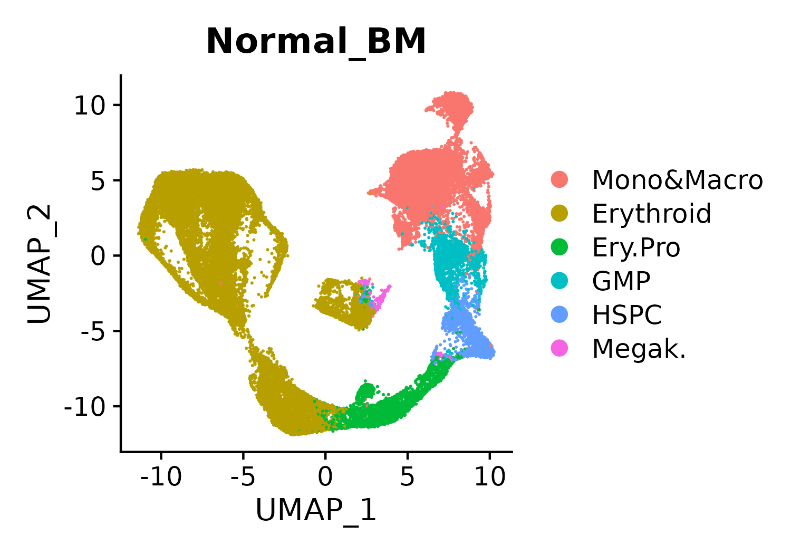
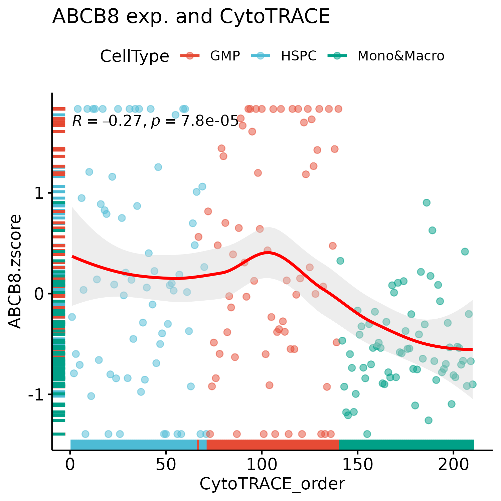
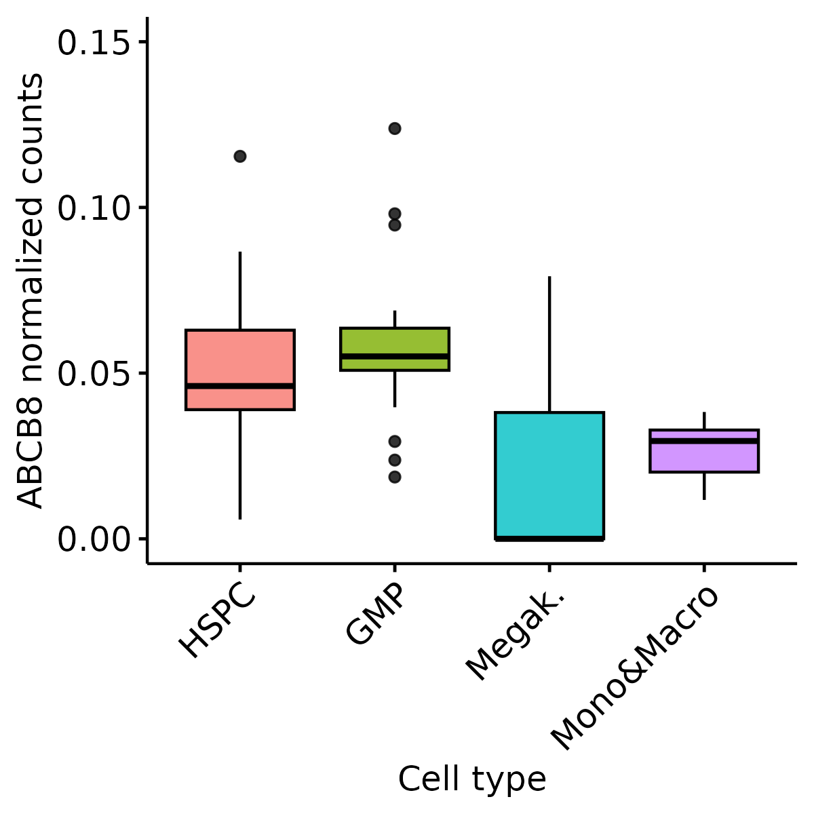
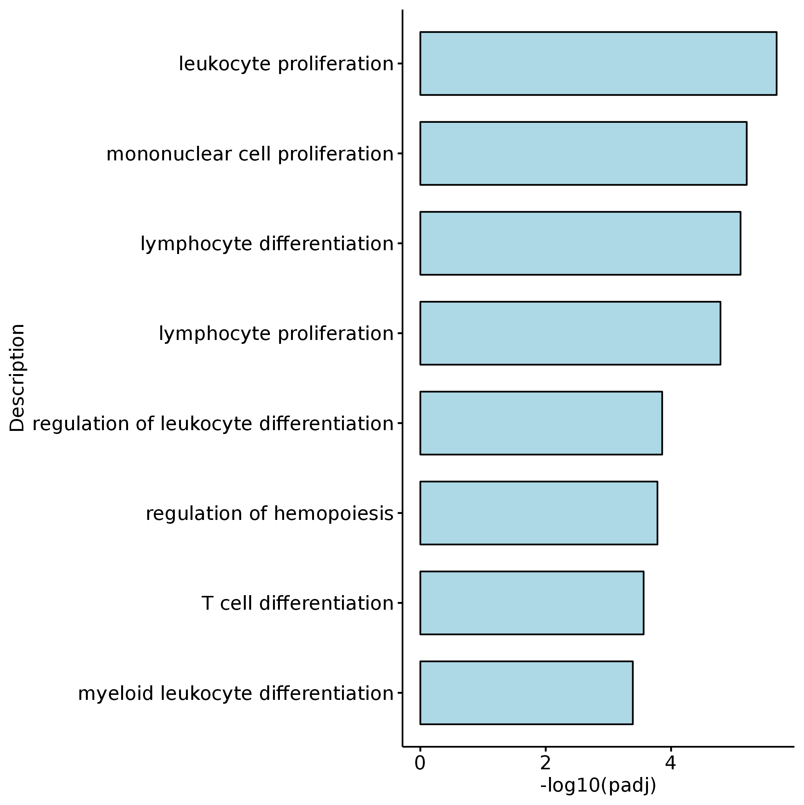
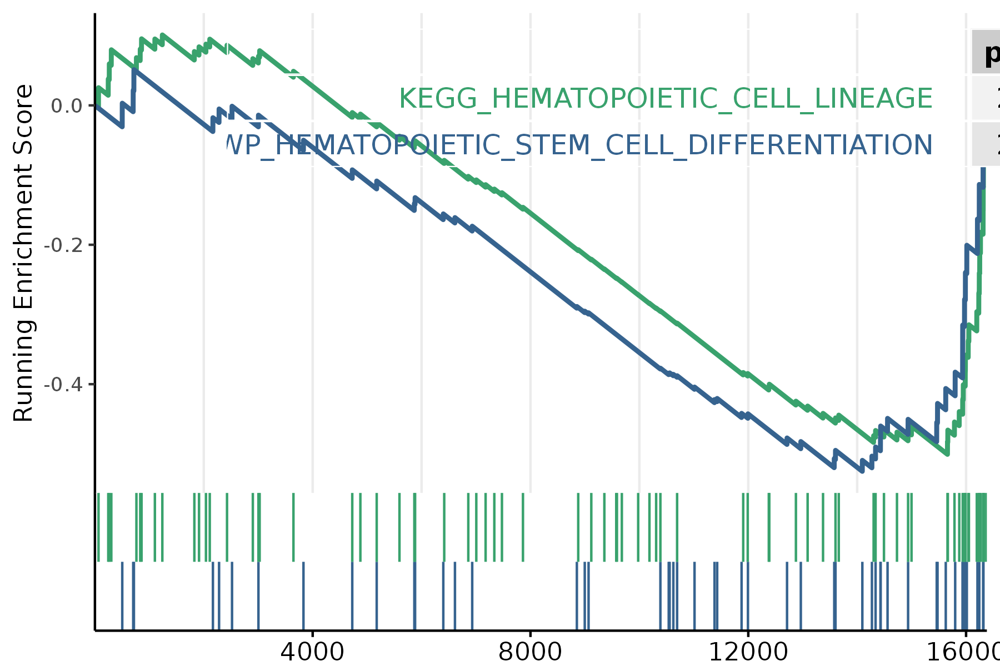

# ABCB8_Fig1

In this pipeline, we showed the detail codes in Fig1.


```
#load packages
library(Signac)
library(Seurat)
library(GenomicRanges)
library(future)
library(future.apply)
library(dplyr)
library(reticulate)
library(ReductionWrappers)
library(s2a)
library(cowplot)
library(ggplot2)
library(trqwe)
library(patchwork)
library(BuenColors)
library(paletteer)
library(ggsci)
library(AnnotationDbi)
library(org.Mm.eg.db)
library(org.Hs.eg.db)
library(clusterProfiler)
library(KEGG.db)
library(scCustomize)
library(Nebulosa)
library(SCP)
library(RColorBrewer)
library(ggpubr)
library(reshape2)
plan("multiprocess", workers = 10)
options(future.globals.maxSize = 200000 * 1024^2) # for 200 Gb RAM
```
#### Fig1E
```
bao_myeloid <- mcreadRDS("/mnt/data/user_data/yiman/project/zjn_abcb8_screening/Bao.patient.normal.BM.myeloid.final.rds", mc.cores = 20)
p <- DimPlot(object = bao_myeloid, reduction = "umap",repel=TRUE,label=FALSE,group.by="CellType",raster = FALSE) + ggtitle("Normal_BM")
ggsave(height=3.5,width=5,"/mnt/data/user_data/yiman/project/zjn_abcb8_screening/github_code/Dimplot_Bao.patient.normal.BM.myeloid.final.png")

```


#### Fig1F
```

data_tmp <- as.matrix(GetAssayData(object = bao_myeloid, slot = "counts",assay="RNA"))
results <- CytoTRACE(data_tmp, ncores = 20, subsamplesize = 1000)
bao_myeloid$CytoTRACE <- results$CytoTRACE[rownames(bao_myeloid[[]])]
bao_myeloid$CytoTRACErank <- results$CytoTRACErank[rownames(bao_myeloid[[]])]

AML.exp <- FetchData(object = bao_myeloid, vars = c("CytoTRACE","CellType","ABCB8"),slot="data")
AML.exp <- na.omit(AML.exp)
AML.exp$ABCB8 <- as.numeric(AML.exp$ABCB8)
AML.exp$CytoTRACE <- as.numeric(AML.exp$CytoTRACE)

AML.exp <- AML.exp[order(AML.exp$CytoTRACE),]
AML.exp$CytoTRACE_order <- c(1:nrow(AML.exp))

set.seed(6)
AML.exp__ <- AML.exp
CellType <- c("Erythroid","Mono&Macro","HSPC","GMP","Ery.Pro","Megak.")
All_gsva_seura_ <- future_lapply(CellType,function(x) {
    sel_tmp <- AML.exp__[which(AML.exp__$CellType == x),]
    cell_name <- rownames(sel_tmp)
    cell_name <- sample(cell_name,length(cell_name))
    cell.sets1 <- split(cell_name, sort(1:length(cell_name)%%70))
    profile.set1 = matrix(, nrow = length(cell.sets1), ncol = 3)
      for (i in 1:length(cell.sets1)) {
        this.set <- cell.sets1[[i]]
        sub.matrix <- sel_tmp[this.set, ]
        ABCB8 <- mean(sub.matrix$ABCB8)
        CytoTRACE <- mean(sub.matrix$CytoTRACE)
        profile.set1[i,1 ] <- ABCB8
        profile.set1[i,2 ] <- CytoTRACE
        profile.set1[i,3 ] <- x
      }
    rownames(profile.set1) <- paste(x, 1:length(cell.sets1),sep="_")
    colnames(profile.set1) <- c("ABCB8","CytoTRACE","CellType")
    return(profile.set1)
    }, future.seed = TRUE)
All_gsva_seura <- do.call(rbind,All_gsva_seura_)
All_gsva_seura <- as.data.frame(All_gsva_seura)
All_gsva_seura$ABCB8 <- as.numeric(All_gsva_seura$ABCB8)
All_gsva_seura$CytoTRACE <- as.numeric(All_gsva_seura$CytoTRACE)

myeloid.lin <- All_gsva_seura[which(All_gsva_seura$CellType %in% c("Mono&Macro","HSPC","GMP")),]
myeloid.lin <- myeloid.lin[order(myeloid.lin$CytoTRACE,decreasing=TRUE),]
myeloid.lin$CytoTRACE_order <- c(1:nrow(myeloid.lin))
myeloid.lin[which(myeloid.lin$ABCB8 > 0.1),]$ABCB8 <- 0.1
myeloid.lin$ABCB8.zscore <- (myeloid.lin$ABCB8 - mean(myeloid.lin$ABCB8)) / sd(myeloid.lin$ABCB8)
mcsaveRDS(myeloid.lin,"/mnt/data/user_data/yiman/project/zjn_abcb8_screening/github_code/Bao.patient.normal.BM.Cyto.ABCB8.70.rds")

p <- ggscatter(myeloid.lin, 
  x = "CytoTRACE_order", y = "ABCB8.zscore",color="CellType",
  add = "loess", conf.int = TRUE,palette="npg",
  alpha=0.5, fullrange = TRUE, rug = TRUE,size=2,
  title="ABCB8 exp. and CytoTRACE",add.params=list(color = "red", fill = "lightgray")) + 
stat_cor(color="black", method = c("pearson"))

ggsave(height=5,width=5,"/mnt/data/user_data/yiman/project/zjn_abcb8_screening/github_code/Cyto.ABCB8.Bao.patient.normal.BM.myeloid.70.seed6.png")

```



#### Fig1G

```
table(bao_myeloid$CellType)
SCLC.only.GSVA <- bao_myeloid
Idents(SCLC.only.GSVA) <- SCLC.only.GSVA$CellType
SCLC.only.GSVA$CellType <- factor(SCLC.only.GSVA$CellType,levels=
  c("HSPC","GMP","Ery.Pro","Erythroid","Megak.","Mono&Macro"))
Idents(SCLC.only.GSVA) <- SCLC.only.GSVA$CellType
SCLC.only.GSVA$CellType <- factor(SCLC.only.GSVA$CellType,levels=
  c("HSPC","GMP","Ery.Pro","Erythroid","Megak.","Mono&Macro"))
All_gsva_seura_ <- future_lapply(1:length(levels(SCLC.only.GSVA$CellType)),function(i) {
    sel_tmp <- subset(SCLC.only.GSVA,idents=levels(SCLC.only.GSVA$CellType)[i])
    sel_tmp <- pseudo_bulk_seurat_mean_random(seurat_obj=sel_tmp,num_split=20,seed.use=1,slot="data",prefix=levels(SCLC.only.GSVA$CellType)[i],assay="RNA")
    metadata <- data.frame(cell_type=c(rep(levels(SCLC.only.GSVA$CellType)[i],20)),
    row.names=colnames(sel_tmp))
    sel_gsva_seurat <- CreateSeuratObject(counts = sel_tmp,assay = 'RNA',project = 'RNA',min.cells = 0,meta.data = metadata)
    message(levels(SCLC.only.GSVA$CellType)[i], " is done")
    return(sel_gsva_seurat)
})
All_gsva_seura <- merge(x = All_gsva_seura_[[1]], y = All_gsva_seura_[c(2:length(All_gsva_seura_))])
All_gsva_seura$cell_type <- factor(All_gsva_seura$cell_type,levels=c("HSPC","GMP","Ery.Pro","Erythroid","Megak.","Mono&Macro"))
Idents(All_gsva_seura) <- All_gsva_seura$cell_type
mcsaveRDS(All_gsva_seura,"/mnt/data/user_data/yiman/project/zjn_abcb8_screening/Bao.patient.normal.BM.myeloid.RNA.20.rds")

All_gsva_seura <- mcreadRDS("/mnt/data/user_data/yiman/project/zjn_abcb8_screening/Bao.patient.normal.BM.myeloid.RNA.20.rds")
All_gsva_seura$cell_type <- factor(All_gsva_seura$cell_type,levels=c("HSPC","GMP","Ery.Pro","Erythroid","Megak.","Mono&Macro"))

all_data <- FetchData(object = All_gsva_seura, vars = c("ABCB8","cell_type"),slot="data")
all_data <- all_data[which(all_data$cell_type %in% c("HSPC","GMP","Megak.","Mono&Macro")),]

p <- ggboxplot(all_data,x="cell_type",y="ABCB8",fill="cell_type",group="cell_type",alpha=0.8,
  xlab="Cell type",ylab="ABCB8 normalized counts")+RotatedAxis()+NoLegend()+ylim(0,0.15)

ggsave(height=4,width=4,"/mnt/data/user_data/yiman/project/zjn_abcb8_screening/github_code/boxplot.Bao.patient.normal.BM.myeloid.ABCB8.20.png")

```


#### Fig1K


```
anno_data <- org.Mm.eg.db
organism <- "mouse"
#anno_data=org.Hs.eg.db
#organism <- "hsa"
load("/mnt/data/user_data/xiangyu/workshop/WORKFLOW_RNAseq/ebg_mm10.RData")
load("/mnt/data/user_data/xiangyu/workshop/WORKFLOW_RNAseq/txdb_mm10.RData")

all_sample <- read.csv("/mnt/data/user_data/yiman/workshop/RNAseq/Abcb8_zjn/basic_counts/all_sampletable.csv",row.names=1)
setwd("/mnt/data/user_data/zlu/01_job/ZJN_Abcb8_cuttag/RNA_seq/RNA_seq_second_batch/1.mm10_star_out/")
bamfiles <- BamFileList(as.vector(all_sample$sample), yieldSize=2000000)   
seqinfo(bamfiles[1])
register(MulticoreParam(workers=8))
registered()
se <- summarizeOverlaps(features=ebg, reads=bamfiles,
mode="Union",
singleEnd=FALSE,
ignore.strand=TRUE,
fragments=FALSE)
colData(se) <- DataFrame(all_sample)  
setwd("/mnt/data/user_data/yiman/workshop/RNAseq/Abcb8_zjn/basic_counts/")
save(se,file="all_sample_se.RData")
countdata <- assay(se)
colnames(countdata) <- coldata$sample
write.csv(countdata,"rawcounts_all.csv")

rcount_all <- read.csv("/mnt/data/user_data/yiman/workshop/RNAseq/Abcb8_zjn/basic_counts/rawcounts_all.csv",row.names=1)
ckt_rcounts <- rcount_all[,10:18] 
ckit_info <- all_sample[10:18,]
dds_ckit <- DESeqDataSetFromMatrix(countData = ckit_rcounts,
                                 colData = ckit_info,
                                 design = ~deal)
dds_ckit <- DESeqDataSet(dds_ckit, design = ~deal)
dds_ckit <- DESeq(dds_ckit)
ckit_nom <- counts(dds_ckit, normalized=TRUE)
ckit_nom <- as.data.frame(ckit_nom)
write.csv(ckit_nom,file='/mnt/data/user_data/yiman/workshop/RNAseq/Abcb8_zjn/basic_counts/ckit_nom.csv')

dds_ckit2 <- DESeqDataSetFromMatrix(countData = ckit_rcounts,
                                 colData = ckit_info,
                                 design = ~group)
dds_ckit2 <- DESeqDataSet(dds_ckit2, design = ~group)
dds_ckit2 <- DESeq(dds_ckit2)
res_ckit_sh_ren <- results(dds_ckit2,contrast=c('group',"ckit_shA","ckit_shRen"),parallel=T)
res_ckit_sh_ren <- as.data.frame(res_ckit_sh_ren)
res_ckit_sh_ren$ENSEMBL <- mapIds(x = anno_data,
                          keys = rownames(res_ckit_sh_ren),
              keytype ="SYMBOL",
              column ="ENSEMBL",
              multiVals="first")
res_ckit_sh_ren$entrez <- mapIds(x = anno_data,
                          keys = rownames(res_ckit_sh_ren),
              keytype ="SYMBOL",
              column ="ENTREZID",
              multiVals="first")
res_ckit_sh_ren_all <- cbind(rcount_all[,c(10:18)],ckit_nom,res_ckit_sh_ren)
write.csv(res_ckit_sh_ren_all,file='/mnt/data/user_data/yiman/workshop/RNAseq/Abcb8_zjn/DEG_out/res_ckit_sh_ren_all.csv')

res_ckit_all <- read.csv(file='/mnt/data/user_data/yiman/workshop/RNAseq/Abcb8_zjn/DEG_out/res_ckit_sh_ren_all.csv',row.names=1)
abcb8_ren_rna_dn <- subset(res_ckit_all,pvalue < 0.05 & log2FoldChange < -0.5)
abcb8_ren_rna_dn <- unique(rownames(abcb8_ren_rna_dn))

sha_ren_dn <- res_ckit_all[abcb8_ren_rna_dn,c(16:17,13:15,10:12,26)]
colnames(sha_ren_dn) <- gsub("\\.1","",colnames(sha_ren_dn))

sha_ren_dn <- na.omit(sha_ren_dn) 
sha_ren_dn <- sha_ren_dn$entrez

GOupres_1_all <- enrichGO(gene = sha_ren_dn, 
             OrgDb = org.Mm.eg.db,
              ont = "BP", 
                 pvalueCutoff = 0.01, 
                     pAdjustMethod = "BH", 
                     qvalueCutoff = 0.01,
                     minGSSize = 10, 
                     maxGSSize = 500, 
                     readable = TRUE, 
                     pool = FALSE)
library(enrichplot)
write.csv(GOupres_1_all,'/mnt/data/user_data/yiman/workshop/RNAseq/Abcb8_zjn/figure/ckit_down_GO_BP.csv')

GO_shA_down <- read.csv(row.names=1,'/mnt/data/user_data/yiman/workshop/RNAseq/Abcb8_zjn/figure/ckit_down_GO_BP.csv')
GO_shA_down$Description <- as.character(GO_shA_down$Description)
GO_shA_down$log10p <- -log10(GO_shA_down$p.adjust)
GO_shA_down$label <- ""

GO_shA_down[which(GO_shA_down$Description %in% c("leukocyte proliferation","mononuclear cell proliferation",
  "lymphocyte differentiation","lymphocyte proliferation","regulation of leukocyte differentiation","regulation of hemopoiesis",
  "T cell differentiation","myeloid leukocyte differentiation")),]$label <- GO_shA_down[which(GO_shA_down$Description %in% c("leukocyte proliferation","mononuclear cell proliferation",
  "lymphocyte differentiation","lymphocyte proliferation","regulation of leukocyte differentiation","regulation of hemopoiesis",
  "T cell differentiation","myeloid leukocyte differentiation")),]$Description
GO_plot <- GO_shA_down[which(GO_shA_down$label != ""),]
GO_plot[which(GO_plot$Count < 0),]$log10p <- -GO_plot[which(GO_plot$Count < 0),]$log10p

p <- ggbarplot(GO_plot, x = "Description", y = "log10p",
          fill = "lightblue",           # change fill color by mpg_level
          sort.val = "asc",          # Sort the value in descending order
          sort.by.groups = FALSE,     # Don't sort inside each group
          x.text.angle = 0,          # Rotate vertically x axis texts
          ylab = "-log10(padj)",
          legend.title = "Enrichment Group",
          rotate = TRUE,
          ggtheme = theme_pubr()
          )

ggsave("/mnt/data/user_data/yiman/workshop/RNAseq/Abcb8_zjn/github_code/barplot.GO.shA_vs_shR.Fig1.png")


```


#### Fig1L

```
ckit_sh_ren_gct <- res_ckit_sh_ren_all[,c(10:18,25)]
ckit_sh_ren_gct <- na.omit(ckit_sh_ren_gct)
write.csv(ckit_sh_ren_gct,file='/mnt/data/user_data/yiman/workshop/RNAseq/Abcb8_zjn/DEG_out/ckit_sh_ren_gct.csv')

cd /mnt/data/user_data/yiman/workshop/RNAseq/Abcb8_zjn/DEG_out/GSEA/

java -cp /mnt/data/user_data/xiangyu/programme/gsea/gsea-3.0.jar -Xmx20480m xtools.gsea.Gsea \
-res ckit_sh_ren.gct \
-cls ckit_all_ren.cls#ckit_shA_versus_ckit_shRen \
-gmx /mnt/data/user_data/xiangyu/programme/gsea/msigdb_v7.1/msigdb_v7.1_GMTs/indivi_gmt/h.all.v7.1.symbols.gmt \
-chip /mnt/data/user_data/xiangyu/programme/gsea/chip/ENSEMBL_mouse_gene.chip \
-collapse true -mode Max_probe -norm meandiv -nperm 1000 -permute gene_set \
-rnd_type no_balance -scoring_scheme weighted -rpt_label my_analysis \
-metric Signal2Noise -sort real -order descending -include_only_symbols true \
-make_sets true -median false -num 100 -plot_top_x 50 -rnd_seed timestamp \
-save_rnd_lists false -set_max 500 -set_min 15 -zip_report false \
-out ./ckit_shA_ren_h -gui false

java -cp /mnt/data/user_data/xiangyu/programme/gsea/gsea-3.0.jar -Xmx20480m xtools.gsea.Gsea \
-res ckit_sh_ren.gct \
-cls ckit_all_ren.cls#ckit_shA_versus_ckit_shRen \
-gmx /mnt/data/user_data/xiangyu/programme/gsea/msigdb_v7.1/msigdb_v7.1_GMTs/indivi_gmt/c5.all.v7.1.symbols.gmt \
-chip /mnt/data/user_data/xiangyu/programme/gsea/chip/ENSEMBL_mouse_gene.chip \
-collapse true -mode Max_probe -norm meandiv -nperm 1000 -permute gene_set \
-rnd_type no_balance -scoring_scheme weighted -rpt_label my_analysis \
-metric Signal2Noise -sort real -order descending -include_only_symbols true \
-make_sets true -median false -num 100 -plot_top_x 50 -rnd_seed timestamp \
-save_rnd_lists false -set_max 500 -set_min 15 -zip_report false \
-out ./ckit_shA_ren_c5 -gui false


geneList <- fread("/mnt/data/user_data/yiman/workshop/RNAseq/Abcb8_zjn/figure/ckit_sh_ren.ckit_sh_ren_collapsed_to_symbols.rnk")
geneList <- as.data.frame(geneList)
geneList_ <- geneList$V2
names(geneList_) <- geneList$V1

all_GSEA_GMT <- read.gmt("/mnt/data/user_data/yiman/workshop/RNAseq_ref/GSEA/msigdb_v2022.1.Hs_files_to_download_locally/msigdb_v2022.1.Hs_GMTs/msigdb.v2022.1.Hs.symbols.gmt")

gsea_ABCB8 <- GSEA(geneList_,  #待富集的基因列表
    TERM2GENE = all_GSEA_GMT,  #基因集
    pvalueCutoff = 0.05,  #指定 p.adjust 值阈值（可指定 1 以输出全部）
    pAdjustMethod = 'BH',
    nPerm = 10000,
    minGSSize = 15,
     by = "fgsea")  #指定 p 值校正方法

gsea_df <- gsea_ABCB8@result
filtered_gsea_df <- gsea_df[grep("HEMATOPOIETIC",gsea_df$ID), ]
filtered_gsea_results <- gsea_ABCB8
filtered_gsea_results@result <- filtered_gsea_df

library(enrichplot)
unique(filtered_gsea_df$ID)
filtered_gsea_df[c(4,5,7,8),]

p5 <- gseaplot2(filtered_gsea_results, 
                geneSetID = c(4,5), #或直接输入基因集ID向量名，如c("hsa04610","hsa00260")
                color = c("#39a26d","#36638f"),
                pvalue_table = TRUE,
                ES_geom = "line",
                rel_heights = c(1.5, 0.5, 1), #子图高度
                subplots = 1:2
)

ggsave(width=6,height=4,"/mnt/data/user_data/yiman/workshop/RNAseq/Abcb8_zjn/github_code/gseaplot.GSEA.shA.all.vs.shR.Fig1.png")


```


