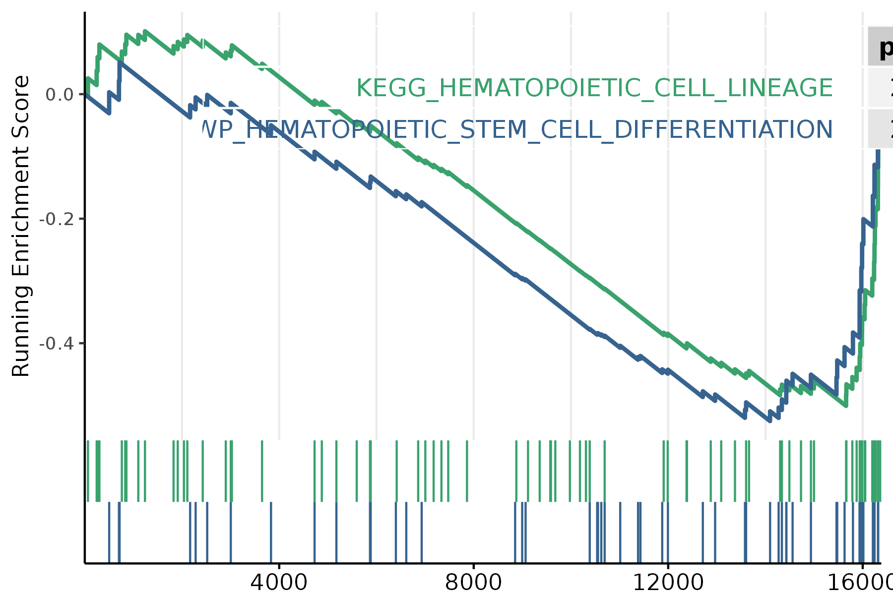
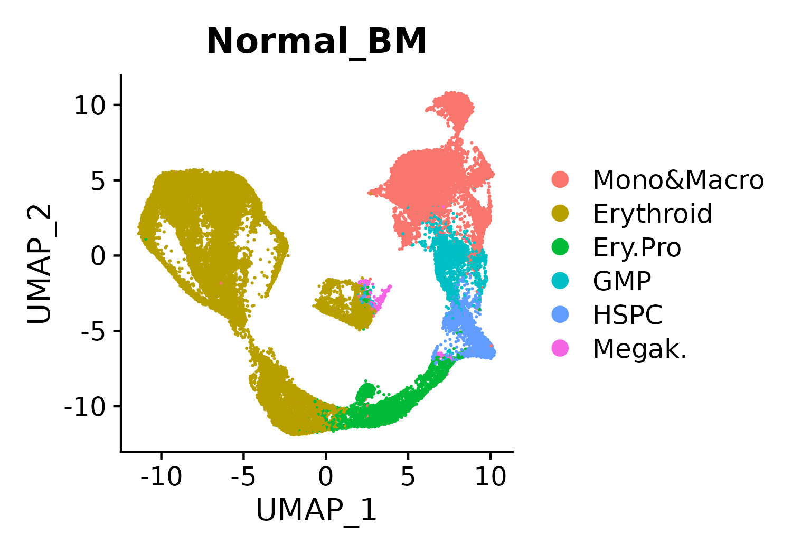

# ABCB8_Fig1 & FigS1

In this pipeline, we showed the detail codes in Fig1 & FigS1.


```
#load packages
library(Signac)
library(Seurat)
library(GenomicRanges)
library(future)
library(future.apply)
library(dplyr)
library(reticulate)
library(ReductionWrappers)
library(s2a)
library(cowplot)
library(ggplot2)
library(trqwe)
library(patchwork)
library(BuenColors)
library(paletteer)
library(ggsci)
library(AnnotationDbi)
library(org.Mm.eg.db)
library(org.Hs.eg.db)
library(clusterProfiler)
library(KEGG.db)
library(scCustomize)
library(Nebulosa)
library(SCP)
library(RColorBrewer)
library(ggpubr)
library(reshape2)
plan("multiprocess", workers = 10)
options(future.globals.maxSize = 200000 * 1024^2) # for 200 Gb RAM
```
#### Fig1E


```

GO_shA_down <- read.csv(row.names=1,'./figure/ckit_down_GO_BP.csv')
GO_shA_down$Description <- as.character(GO_shA_down$Description)
GO_shA_down$log10p <- -log10(GO_shA_down$p.adjust)
GO_shA_down$label <- ""

GO_shA_down[which(GO_shA_down$Description %in% c("lymphocyte differentiation","regulation of leukocyte differentiation","regulation of hemopoiesis","T cell differentiation","myeloid leukocyte differentiation","leukocyte homeostasis","myeloid cell differentiation")),]$label <- GO_shA_down[which(GO_shA_down$Description %in% c("lymphocyte differentiation","regulation of leukocyte differentiation","regulation of hemopoiesis","T cell differentiation","myeloid leukocyte differentiation","leukocyte homeostasis","myeloid cell differentiation")),]$Description
GO_plot <- GO_shA_down[which(GO_shA_down$label != ""),]
GO_plot[which(GO_plot$Count < 0),]$log10p <- -GO_plot[which(GO_plot$Count < 0),]$log10p

p <- ggbarplot(GO_plot, x = "Description", y = "log10p",
          fill = "lightblue",           # change fill color by mpg_level
          sort.val = "asc",          # Sort the value in descending order
          sort.by.groups = FALSE,     # Don't sort inside each group
          x.text.angle = 0,          # Rotate vertically x axis texts
          ylab = "-log10(padj)",
          legend.title = "Enrichment Group",
          rotate = TRUE,
          ggtheme = theme_pubr()
          )

```


#### Fig1F

```

geneList <- fread("./figure/ckit_sh_ren.ckit_sh_ren_collapsed_to_symbols.rnk")
geneList <- as.data.frame(geneList)
geneList_ <- geneList$V2
names(geneList_) <- geneList$V1

all_GSEA_GMT <- read.gmt("./workshop/RNAseq_ref/GSEA/msigdb_v2022.1.Hs_files_to_download_locally/msigdb_v2022.1.Hs_GMTs/msigdb.v2022.1.Hs.symbols.gmt")

gsea_ABCB8 <- GSEA(geneList_,  #待富集的基因列表
    TERM2GENE = all_GSEA_GMT,  #基因集
    pvalueCutoff = 0.05,  #指定 p.adjust 值阈值（可指定 1 以输出全部）
    pAdjustMethod = 'BH',
    nPerm = 10000,
    minGSSize = 15,
     by = "fgsea")  #指定 p 值校正方法

gsea_df <- gsea_ABCB8@result
filtered_gsea_df <- gsea_df[grep("HEMATOPOIETIC",gsea_df$ID), ]
filtered_gsea_results <- gsea_ABCB8
filtered_gsea_results@result <- filtered_gsea_df

library(enrichplot)
unique(filtered_gsea_df$ID)
filtered_gsea_df[c(4,5,7,8),]

p5 <- gseaplot2(filtered_gsea_results, 
                geneSetID = c(4,5), #或直接输入基因集ID向量名，如c("hsa04610","hsa00260")
                color = c("#39a26d","#36638f"),
                pvalue_table = TRUE,
                ES_geom = "line",
                rel_heights = c(1.5, 0.5, 1), #子图高度
                subplots = 1:2
)


```



#### Fig1G
```
bao_myeloid <- mcreadRDS("./project/zjn_abcb8_screening/Bao.patient.normal.BM.myeloid.final.rds", mc.cores = 20)
p <- DimPlot(object = bao_myeloid, reduction = "umap",repel=TRUE,label=FALSE,group.by="CellType",raster = FALSE) + ggtitle("Normal_BM")

```



#### Fig1H

```

All_gsva_seura <- mcreadRDS("./human_data/Bao.patient.normal.BM.myeloid.RNA.20.rds")
All_gsva_seura$cell_type <- factor(All_gsva_seura$cell_type,levels=c("HSPC","GMP","Ery.Pro","Erythroid","Megak.","Mono&Macro"))

all_data <- FetchData(object = All_gsva_seura, vars = c("ABCB8","cell_type"),slot="data")

p <- ggboxplot(all_data,x="cell_type",y="ABCB8",fill="cell_type",group="cell_type",alpha=0.8,
  xlab="Cell type",ylab="ABCB8 normalized counts")+RotatedAxis()+NoLegend()

```


#### FigS1C

```

bao_myeloid <- mcreadRDS("./project/9_ABCB8/raw_files/Bao.patient.normal.BM.myeloid.final.rds", mc.cores = 20)

Idents(bao_myeloid) <- bao_myeloid$CellType
true_myeloid <- subset(bao_myeloid,idents=c("Mono&Macro","HSPC","GMP"))

true_myeloid <- true_myeloid %>%
    NormalizeData(verbose = FALSE) %>%
    FindVariableFeatures(selection.method = "vst", nfeatures = 4000) %>% 
    ScaleData(verbose = TRUE)
true_myeloid <- true_myeloid %>% 
    RunHarmony("sample", plot_convergence = TRUE) %>% 
    DoForceAtlas2(reduction_use = "harmony",reduction_save = "fa2",dims_use = 1:10)
mcsaveRDS(true_myeloid,"./project/9_ABCB8/raw_files/bao.only.3myeloid.rds", mc.cores = 20)

true_myeloid <- mcreadRDS("./project/9_ABCB8/raw_files/bao.only.3myeloid.rds", mc.cores = 20)
umap_coords <- Embeddings(true_myeloid, reduction = "fa2")
new_umap_coords <- umap_coords
new_umap_coords[,1] <- -new_umap_coords[,1]
true_myeloid[["fa2"]]@cell.embeddings <- new_umap_coords
DimPlot(object = true_myeloid, reduction = "fa2",repel=TRUE,pt.size=3,label=TRUE,group.by="CellType",raster = TRUE,raster.dpi=c(1000,1000)) 
mcsaveRDS(true_myeloid,"./project/9_ABCB8/raw_files/bao.only.3myeloid.rds", mc.cores = 20)

library(slingshot, quietly = TRUE)
library(splatter, quietly = TRUE)
sim <- as.SingleCellExperiment(true_myeloid)
colData(sim)$order <- colData(sim)$CellType
table(colData(sim)$CellType)
library(RColorBrewer)
colors <- brewer.pal(8,'Set1')
sce <- slingshot(sim, clusterLabels = 'CellType', reducedDim = 'FA2', start.clus = "HSPC",approx_points=1000)
par(mar = rep(2, 4))
plot(reducedDims(sce)$FA2, pch = 16,col = colors[colData(sim)$order])
lines(SlingshotDataSet(sce), lwd=2, col='black',show.constraints = TRUE)

png("./project/9_ABCB8/figure_plot/slingshot.3myeloid.pdf.png")
par(mar = rep(2, 4))
plot(reducedDims(sce)$FA2, pch = 16,col = colors[colData(sim)$order])
lines(SlingshotDataSet(sce), lwd=2, col='black',show.constraints = TRUE)
dev.off()


```


#### Fig1I
```

myeloid.lin <- mcreadRDS("./project/zjn_abcb8_screening/github_code/Bao.patient.normal.BM.Cyto.ABCB8.70.rds")

p <- ggscatter(myeloid.lin, 
  x = "CytoTRACE_order", y = "ABCB8.zscore",color="CellType",
  add = "loess", conf.int = TRUE,palette="npg",
  alpha=0.5, fullrange = TRUE, rug = TRUE,size=2,
  title="ABCB8 exp. and CytoTRACE",add.params=list(color = "red", fill = "lightgray")) + 
stat_cor(color="black", method = c("pearson"))

```


