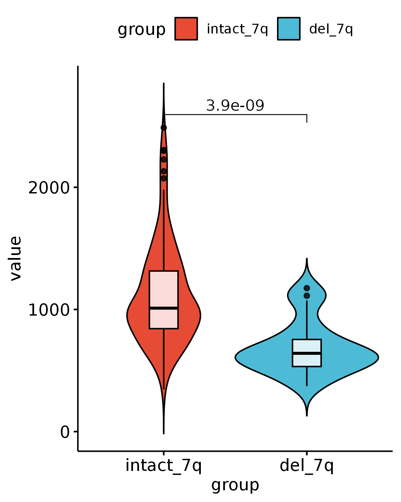
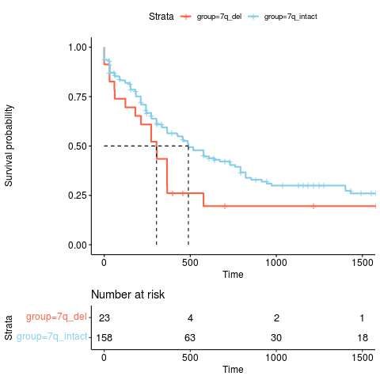
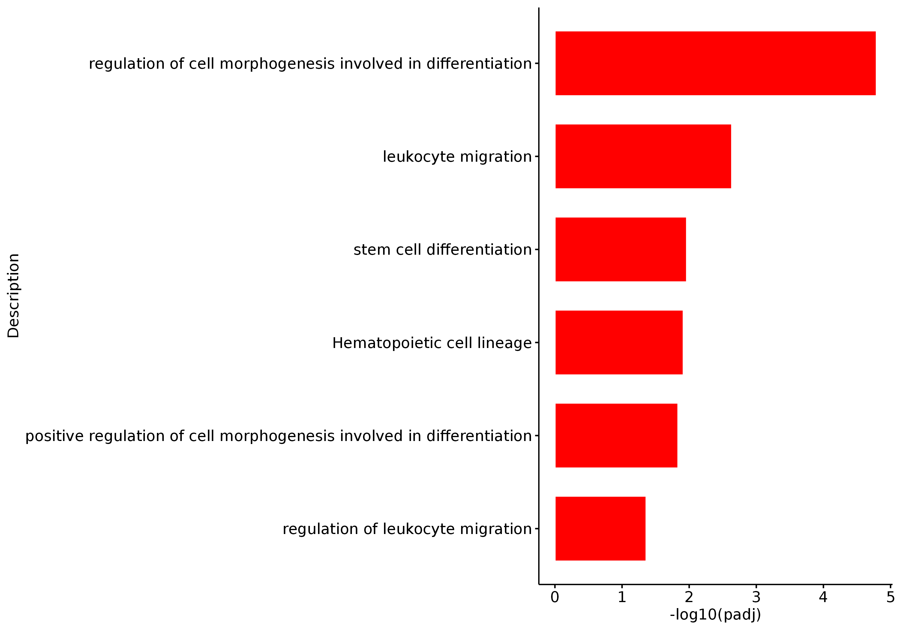
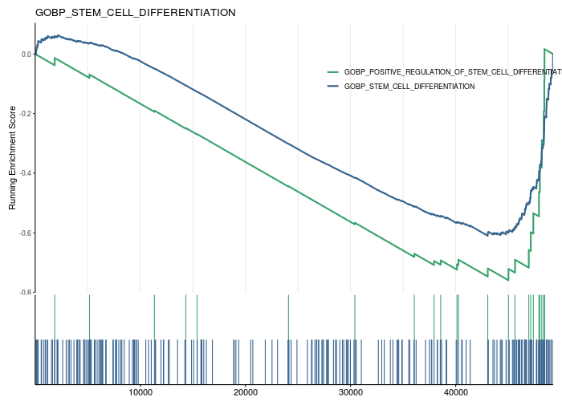

# ABCB8_Fig2

In this pipeline, we showed the detail codes in Fig2.

```
#load packages
library(Signac)
library(Seurat)
library(GenomicRanges)
library(future)
library(future.apply)
library(dplyr)
library(reticulate)
library(ReductionWrappers)
library(s2a)
library(cowplot)
library(ggplot2)
library(trqwe)
library(patchwork)
library(BuenColors)
library(paletteer)
library(ggsci)
library(AnnotationDbi)
library(org.Mm.eg.db)
library(org.Hs.eg.db)
library(clusterProfiler)
library(KEGG.db)
library(scCustomize)
library(Nebulosa)
library(SCP)
library(RColorBrewer)
library(ggpubr)
library(reshape2)
plan("multiprocess", workers = 10)
options(future.globals.maxSize = 200000 * 1024^2) # for 200 Gb RAM
```
#### Fig2A
```
dds_all_normalize <- mcreadRDS("/mnt/data/user_data/yiman/workshop/RNAseq/Abcb8_zjn/human_data/TCGA_LAML_7q_norm_counts.tidy.rds",mc.cores=20)
sampleTable <- mcreadRDS("/mnt/data/user_data/yiman/workshop/RNAseq/Abcb8_zjn/human_data/TCGA_LAML_7q.sampleTable.tidy.rds",mc.cores=20)
ABCB8_counts <- dds_all_normalize[which(dds_all_normalize$SYMBOL_hs=="ABCB8"),]
ABCB8_counts <- ABCB8_counts[,-ncol(ABCB8_counts)]
ABCB8_counts <- melt(ABCB8_counts)
rownames(sampleTable) <- sampleTable$sample
ABCB8_counts$group <- sampleTable[ABCB8_counts$variable,2]
ABCB8_counts$group <- factor(ABCB8_counts$group,levels=c("intact_7q","del_7q"))

p1 <- ggviolin(ABCB8_counts, "group", "value", fill = "group",
   palette = "npg",add = c("boxplot"), add.params = list(fill = "white",alpha=0.8)) +
  stat_compare_means(comparisons=list(c("intact_7q","del_7q")),method="t.test")
ggsave(width=4,height=5,"/mnt/data/user_data/yiman/workshop/RNAseq/Abcb8_zjn/github_code/violin.TCGA_LAML_ABCB8_Normalized_counts.png")

```


#### Fig2B
```
sampleTable <- read.csv(row.names=1,"/mnt/data/user_data/yiman/workshop/RNAseq/Abcb8_zjn/human_data/AML_patients_7q_status_TCGA_LAML.csv")
chr7q_deletion_sample <- as.character(sampleTable[which(sampleTable$group == "del_7q"),"sample"])
chr7q_intact_sample <- as.character(sampleTable[which(sampleTable$group == "intact_7q"),"sample"])
chr7q_deletion_patinet <- substr(chr7q_deletion_sample,1,12)
chr7q_intact_patient <- substr(chr7q_intact_sample,1,12)
chr7q_deletion_patinet <- gsub("-",".",chr7q_deletion_patinet)
chr7q_intact_patient <- gsub("-",".",chr7q_intact_patient)
chr7q_deletion_patinet <- unique(chr7q_deletion_patinet)
chr7q_intact_patient <- unique(chr7q_intact_patient)

TCGA_LAML_clinical <- read.csv("/mnt/data/user_data/xiangyu/workshop/DATABASE/ALL_TCGA_DATA/clinical_info/ALL_info_includ_RNA_DNA/TCGA/TCGA-LAML_clinical.csv")
TCGA_LAML_clinical <- TCGA_LAML_clinical[,c("X","submitter_id","primary_diagnosis","site_of_resection_or_biopsy","age_at_diagnosis","days_to_death","vital_status","tumor_stage","days_to_last_follow_up")]
TCGA_LAML_clinical$submitter_id <- gsub("-",".",TCGA_LAML_clinical$submitter_id)
rownames(TCGA_LAML_clinical) <- TCGA_LAML_clinical$submitter_id

chr7q_deletion_patinet <- intersect(chr7q_deletion_patinet,rownames(TCGA_LAML_clinical))
chr7q_intact_patient <- intersect(chr7q_intact_patient,rownames(TCGA_LAML_clinical))
TCGA_LAML_clinical <- rbind(TCGA_LAML_clinical[chr7q_deletion_patinet,],TCGA_LAML_clinical[chr7q_intact_patient,])
TCGA_LAML_clinical$group <- c(rep("7q_del",length(chr7q_deletion_patinet)),rep("7q_intact",length(chr7q_intact_patient)))

library("survival")
library("survminer")
meta <- TCGA_LAML_clinical
meta$days_to_last_follow_up <- as.numeric(as.character(meta$days_to_last_follow_up))
meta$days_to_death <- as.numeric(as.character(meta$days_to_death))
meta[is.na(meta)] <- "HHH"
tmp <- subset(meta,days_to_last_follow_up=="HHH")
tmp$days_to_last_follow_up <- tmp$days_to_death
no_na <- meta[setdiff(rownames(meta),rownames(tmp)),]
all_merge <- rbind(tmp,no_na)
all_merge <- subset(all_merge,days_to_last_follow_up != "HHH")
all_merge$vital_status <- as.character(all_merge$vital_status)
all_merge$status <- ifelse(all_merge$vital_status=="Alive",0,1)
all_merge$days_to_last_follow_up <- as.numeric(all_merge$days_to_last_follow_up)

# 创建Surv对象
surv_obj <- Surv(all_merge$days_to_last_follow_up, all_merge$status)

# 使用survfit函数进行生存分析
fit <- survfit(surv_obj ~ group, data = all_merge)

# 使用ggsurvplot函数绘制生存曲线
p <- ggsurvplot(fit, data = all_merge,surv.median.line = "hv",pval = FALSE,
  ggtheme = theme_pubr(),risk.table=TRUE,palette=c("#FF6347","#87CEEB"),
  xlim=c(0,1500),break.time.by=500)
surv_pvalue(fit, method = "FH")

png("/mnt/data/user_data/yiman/workshop/RNAseq/Abcb8_zjn/github_code/TCGA_LAML_7q_survival.png")
p
dev.off()
```


#### Fig2C

```
setwd("/mnt/data/user_data/yiman/workshop/RNAseq/Abcb8_zjn/human_data/aml_ohsu_2022/BeatAML")
ABCB8.exp.group <- read.csv(row.names=1,"beataml_waves1to4.AML.samples.ABCB8.exp.group.csv")
ABCB8.exp.high <- ABCB8.exp.group[which(ABCB8.exp.group$ABCB8.cut.group == "ABCB8_high"),]$dbgap_rnaseq_sample
ABCB8.exp.low <- ABCB8.exp.group[which(ABCB8.exp.group$ABCB8.cut.group == "ABCB8_low"),]$dbgap_rnaseq_sample
ABCB8.exp.high <- as.character(ABCB8.exp.high)
ABCB8.exp.low <- as.character(ABCB8.exp.low)
beat.AML.RNA.raw.counts <- read.csv(row.names=1,'beataml_waves1to4_counts_dbgap.AML.samples.csv')
beat.AML.RNA.raw.counts.sub <- beat.AML.RNA.raw.counts[,c(ABCB8.exp.high,ABCB8.exp.low)]
sampleTable <- data.frame(sample=colnames(beat.AML.RNA.raw.counts.sub),
	Group=c(rep("ABCB8.high",length(ABCB8.exp.high)),rep("ABCB8.low",length(ABCB8.exp.low))))

dds_all <- DESeqDataSetFromMatrix(countData = beat.AML.RNA.raw.counts.sub,
                                 colData = sampleTable,
                                 design = ~Group)
dds_all <- DESeqDataSet(dds_all, design = ~Group)
dds_all <- DESeq(dds_all)
BeatAML.low_vs_high.results <- results(dds_all, contrast=c('Group','ABCB8.low','ABCB8.high'))
BeatAML.low_vs_high.results <- as.data.frame(BeatAML.low_vs_high.results)
BeatAML.low_vs_high.results$entrez <- mapIds(x = org.Hs.eg.db,
                        keys = rownames(BeatAML.low_vs_high.results),
            keytype ="SYMBOL",
            column ="ENTREZID",
            multiVals="first")
BeatAML.low_vs_high.results$ENSEMBL <- mapIds(x = org.Hs.eg.db,
                        keys = rownames(BeatAML.low_vs_high.results),
            keytype ="SYMBOL",
            column ="ENSEMBL",
            multiVals="first")
write.csv(BeatAML.low_vs_high.results,file="BeatAML.low_vs_high.results.csv")

#GO/KEGG
BeatAML.low_vs_high.results <- read.csv(row.names=1,file="BeatAML.low_vs_high.results.csv")
BeatAML.low_vs_high_down <- BeatAML.low_vs_high.results[which(BeatAML.low_vs_high.results$pvalue < 0.05 & BeatAML.low_vs_high.results$log2FoldChange < -0.5),]

GOupres_1_all <- enrichGO(gene = BeatAML.low_vs_high_down$entrez, 
             OrgDb = org.Hs.eg.db,
              ont = "BP", 
                 pvalueCutoff = 0.05, 
                     pAdjustMethod = "BH", 
                     qvalueCutoff = 0.05,
                     minGSSize = 10, 
                     maxGSSize = 500, 
                     readable = TRUE, 
                     pool = FALSE)
KEGGupres_1_all <- enrichKEGG(gene = BeatAML.low_vs_high_down$entrez, 
          organism = 'human', 
          keyType = "ncbi-geneid",
           pvalueCutoff = 0.05,
               pAdjustMethod = "BH", 
               minGSSize = 5, 
               maxGSSize = 500,
               qvalueCutoff = 1, 
               use_internal_data = TRUE)
KEGGupres_1_all <- setReadable(KEGGupres_1_all, org.Hs.eg.db, keyType="ENTREZID")
write.csv(GOupres_1_all,'./DEG_outs/GO_BeatAML.low_vs_high_down.fc0.5.csv')
write.csv(KEGGupres_1_all,'./DEG_outs/KEGG_BeatAML.low_vs_high_down.fc0.5.csv')

GOupres_1_all <- read.csv(row.names=1,'./DEG_outs/GO_BeatAML.low_vs_high_down.fc0.5.csv')
KEGGupres_1_all <- read.csv(row.names=1,'./DEG_outs/KEGG_BeatAML.low_vs_high_down.fc0.5.csv')
Enrich.all <- rbind(GOupres_1_all,KEGGupres_1_all)
Enrich.all$log10p <- -log10(Enrich.all$p.adjust)
Enrich.sub <- Enrich.all[which(Enrich.all$Description %in% c("regulation of cell morphogenesis involved in differentiation","leukocyte migration",
	"stem cell differentiation","positive regulation of cell morphogenesis involved in differentiation","regulation of leukocyte migration","Hematopoietic cell lineage")),]

p <- ggbarplot(Enrich.sub, x = "Description", y = "log10p",
          fill = "red",           # change fill color by mpg_level
          color = "white",            # Set bar border colors to white
          ylab = "-log10(padj)",
          sort.val = c("asc"),
          legend.title = "Enrichment Group",
          rotate = TRUE,
          ggtheme = theme_pubr()
          )

ggsave(width=10,"/mnt/data/user_data/yiman/workshop/RNAseq/Abcb8_zjn/github_code/barplot.BeatAML.ABCB8.low_vs_high.GO.KEGG.Diff.png")

```



#### Fig2D

```
setwd("/mnt/data/user_data/yiman/workshop/RNAseq/Abcb8_zjn/human_data/aml_ohsu_2022/BeatAML")

BeatAML.low_vs_high.results <- read.csv(row.names=1,file="BeatAML.low_vs_high.results.csv")
BeatAML.low_vs_high.results$SYMBOL <- rownames(BeatAML.low_vs_high.results)
BeatAML_low_vs_high <- BeatAML.low_vs_high.results[,c("log2FoldChange","SYMBOL")]
BeatAML_low_vs_high <- BeatAML_low_vs_high[order(BeatAML_low_vs_high$log2FoldChange,decreasing=TRUE),]
BeatAML_low_vs_high <- na.omit(BeatAML_low_vs_high)
aa <- BeatAML_low_vs_high$log2FoldChange
names(aa) <- BeatAML_low_vs_high$SYMBOL
geneList = sort(aa,decreasing = T)
all_GSEA_GMT <- read.gmt("/mnt/data/user_data/yiman/workshop/RNAseq_ref/GSEA/msigdb_v2022.1.Hs_files_to_download_locally/msigdb_v2022.1.Hs_GMTs/msigdb.v2022.1.Hs.symbols.gmt")
gsea_BeatAML <- GSEA(geneList,  #待富集的基因列表
    TERM2GENE = all_GSEA_GMT,  #基因集
    pvalueCutoff = 0.05,  #指定 p.adjust 值阈值（可指定 1 以输出全部）
    pAdjustMethod = 'BH',
    nPerm = 100000)  #指定 p 值校正方法
mcsaveRDS(gsea_BeatAML,"./DEG_outs/GSEA.BeatAML.ABCB8.low.vs.high.nPerm100000.rds")

gsea_BeatAML <- mcreadRDS("./DEG_outs/GSEA.BeatAML.ABCB8.low.vs.high.nPerm100000.rds")
gsea_df <- read.csv(row.names=1,"./DEG_outs/GSEA.BeatAML.ABCB8.low.vs.high.nPerm100000.csv")
filtered_gsea_df <- gsea_df[grep("DIFFERENTIATION",gsea_df$ID), ]
filtered_gsea_results <- gsea_BeatAML
filtered_gsea_results@result <- filtered_gsea_df
library(enrichplot)
p <- gseaplot2(filtered_gsea_results, 
                geneSetID = c(4,68), #或直接输入基因集ID向量名，如c("hsa04610","hsa00260")
                color = c("#39a26d","#36638f"),
                pvalue_table = FALSE,
                ES_geom = "line",
                rel_heights = c(1.5, 0.5, 1), #子图高度
                subplots = 1:2,
                title = filtered_gsea_results$Description[4]
)
png(width=700,height=500,"/mnt/data/user_data/yiman/workshop/RNAseq/Abcb8_zjn/github_code/gseaplot2.BeatAML.merge.png")
p
dev.off()
```

