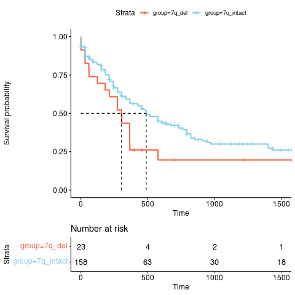
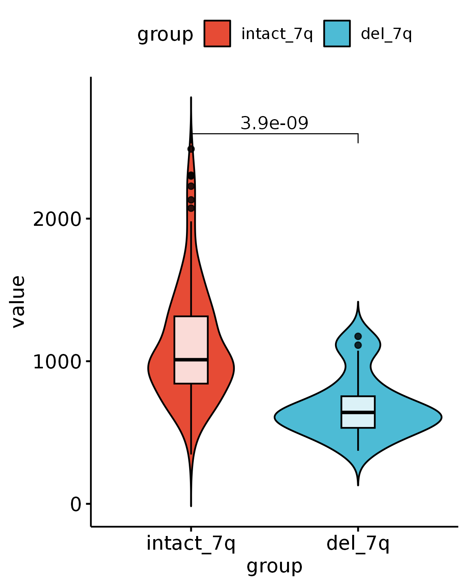

# ABCB8_Fig2 & FigS2

In this pipeline, we showed the detail codes in Fig2 & FigS2.

```
#load packages
library(Signac)
library(Seurat)
library(GenomicRanges)
library(future)
library(future.apply)
library(dplyr)
library(reticulate)
library(ReductionWrappers)
library(s2a)
library(cowplot)
library(ggplot2)
library(trqwe)
library(patchwork)
library(BuenColors)
library(paletteer)
library(ggsci)
library(AnnotationDbi)
library(org.Mm.eg.db)
library(org.Hs.eg.db)
library(clusterProfiler)
library(KEGG.db)
library(scCustomize)
library(Nebulosa)
library(SCP)
library(RColorBrewer)
library(ggpubr)
library(reshape2)
plan("multiprocess", workers = 10)
options(future.globals.maxSize = 200000 * 1024^2) # for 200 Gb RAM
```

#### Fig2A
```
sampleTable <- read.csv(row.names=1,"./AML_patients_7q_status_TCGA_LAML.csv")
chr7q_deletion_sample <- as.character(sampleTable[which(sampleTable$group == "del_7q"),"sample"])
chr7q_intact_sample <- as.character(sampleTable[which(sampleTable$group == "intact_7q"),"sample"])
chr7q_deletion_patinet <- substr(chr7q_deletion_sample,1,12)
chr7q_intact_patient <- substr(chr7q_intact_sample,1,12)
chr7q_deletion_patinet <- gsub("-",".",chr7q_deletion_patinet)
chr7q_intact_patient <- gsub("-",".",chr7q_intact_patient)
chr7q_deletion_patinet <- unique(chr7q_deletion_patinet)
chr7q_intact_patient <- unique(chr7q_intact_patient)

TCGA_LAML_clinical <- read.csv("./ALL_info_includ_RNA_DNA/TCGA/TCGA-LAML_clinical.csv")
TCGA_LAML_clinical <- TCGA_LAML_clinical[,c("X","submitter_id","primary_diagnosis","site_of_resection_or_biopsy","age_at_diagnosis","days_to_death","vital_status","tumor_stage","days_to_last_follow_up")]
TCGA_LAML_clinical$submitter_id <- gsub("-",".",TCGA_LAML_clinical$submitter_id)
rownames(TCGA_LAML_clinical) <- TCGA_LAML_clinical$submitter_id

chr7q_deletion_patinet <- intersect(chr7q_deletion_patinet,rownames(TCGA_LAML_clinical))
chr7q_intact_patient <- intersect(chr7q_intact_patient,rownames(TCGA_LAML_clinical))
TCGA_LAML_clinical <- rbind(TCGA_LAML_clinical[chr7q_deletion_patinet,],TCGA_LAML_clinical[chr7q_intact_patient,])
TCGA_LAML_clinical$group <- c(rep("7q_del",length(chr7q_deletion_patinet)),rep("7q_intact",length(chr7q_intact_patient)))

library("survival")
library("survminer")
meta <- TCGA_LAML_clinical
meta$days_to_last_follow_up <- as.numeric(as.character(meta$days_to_last_follow_up))
meta$days_to_death <- as.numeric(as.character(meta$days_to_death))
meta[is.na(meta)] <- "HHH"
tmp <- subset(meta,days_to_last_follow_up=="HHH")
tmp$days_to_last_follow_up <- tmp$days_to_death
no_na <- meta[setdiff(rownames(meta),rownames(tmp)),]
all_merge <- rbind(tmp,no_na)
all_merge <- subset(all_merge,days_to_last_follow_up != "HHH")
all_merge$vital_status <- as.character(all_merge$vital_status)
all_merge$status <- ifelse(all_merge$vital_status=="Alive",0,1)
all_merge$days_to_last_follow_up <- as.numeric(all_merge$days_to_last_follow_up)

# 创建Surv对象
surv_obj <- Surv(all_merge$days_to_last_follow_up, all_merge$status)

# 使用survfit函数进行生存分析
fit <- survfit(surv_obj ~ group, data = all_merge)

# 使用ggsurvplot函数绘制生存曲线
p <- ggsurvplot(fit, data = all_merge,surv.median.line = "hv",pval = FALSE,
  ggtheme = theme_pubr(),risk.table=TRUE,palette=c("#FF6347","#87CEEB"),
  xlim=c(0,1500),break.time.by=500)
surv_pvalue(fit, method = "FH")

```



#### Fig2B
```
dds_all_normalize <- mcreadRDS("./TCGA_LAML_7q_norm_counts.tidy.rds",mc.cores=20)
sampleTable <- mcreadRDS("./TCGA_LAML_7q.sampleTable.tidy.rds",mc.cores=20)
ABCB8_counts <- dds_all_normalize[which(dds_all_normalize$SYMBOL_hs=="ABCB8"),]
ABCB8_counts <- ABCB8_counts[,-ncol(ABCB8_counts)]
ABCB8_counts <- melt(ABCB8_counts)
rownames(sampleTable) <- sampleTable$sample
ABCB8_counts$group <- sampleTable[ABCB8_counts$variable,2]
ABCB8_counts$group <- factor(ABCB8_counts$group,levels=c("intact_7q","del_7q"))

p1 <- ggviolin(ABCB8_counts, "group", "value", fill = "group",
   palette = "npg",add = c("boxplot"), add.params = list(fill = "white",alpha=0.8)) +
  stat_compare_means(comparisons=list(c("intact_7q","del_7q")),method="t.test")


```


#### Fig2C

```
setwd("./aml_ohsu_2022/BeatAML")

GOupres_1_all <- read.csv(row.names=1,'./DEG_outs/v2.GO_BeatAML.low_vs_high_down.fc1.csv')
KEGGupres_1_all <- read.csv(row.names=1,'./DEG_outs/v2.KEGG_BeatAML.low_vs_high_down.fc1.csv')
Enrich.all <- rbind(as.data.frame(GOupres_1_all),as.data.frame(KEGGupres_1_all))
Enrich.all$log10padj <- -log10(Enrich.all$p.adjust)
Enrich.sub <- Enrich.all[which(Enrich.all$Description %in% c("regulation of mononuclear cell migration",
"regulation of cell morphogenesis involved in differentiation","regulation of cell morphogenesis","stem cell differentiation","Hematopoietic cell lineage")),]

p <- ggbarplot(Enrich.sub, x = "Description", y = "log10padj",
          fill = "red",           # change fill color by mpg_level
          color = "white",            # Set bar border colors to white
          ylab = "-log10(padj)",
          sort.val = c("asc"),
          legend.title = "Enrichment Group",
          rotate = TRUE,
          ggtheme = theme_pubr()
          )+ scale_y_continuous(breaks = seq(0, 3, by = 1))


```

#### Fig2D

```
setwd("./aml_ohsu_2022/BeatAML")

gsea_BeatAML <- mcreadRDS("./DEG_outs/v2.GSEA.BeatAML.ABCB8.low.vs.high.nPerm10000.rds")

library(enrichplot)
p5 <- gseaplot2(gsea_BeatAML, 
                geneSetID = c("GOBP_STEM_CELL_DIFFERENTIATION","GOBP_POSITIVE_REGULATION_OF_STEM_CELL_DIFFERENTIATION"), #或直接输入基因集ID向量名，如c("hsa04610","hsa00260")
                color = c("#39a26d","#36638f"),
                pvalue_table = FALSE,
                ES_geom = "line",
                rel_heights = c(1.5, 0.5, 1), #子图高度
                subplots = 1:2,
                title = "BeatAML",
                base_size = 9
)


```


#### FigS2A

```

library("survival")
library("survminer")

df_plot <- read.csv("./BeatAML.ABCB8.survival.all.merge.csv")

fit <- survfit(Surv(overallSurvival, vitalStatus) ~ ABCB8_group, data = df_plot)

p <- ggsurvplot(fit, data = df_plot,
           surv.median.line = "hv",
           pval = TRUE,
           pval.method = TRUE,
           ggtheme = theme_pubr(),
           risk.table = TRUE,
           palette = "jco",  # 使用jco调色板，支持4种颜色
           xlim = c(0, 2000),
           break.time.by = 500,
           title = "Combined Survival Analysis of ABCB8")


```


#### FigS2B-C

```


GSE146173.clinical <- mcreadRDS("./GSE146173.pdata.rds")
GSE146173.clinical <- GSE146173.clinical[,1:53]
library(stringr)
GSE146173.clinical$SampleID <- str_split_fixed(GSE146173.clinical$title, ":", 2)[,1]

GSE146173.exp <- mcreadRDS("./GSE146173.exp.clean.rds")
GSE146173.exp <- t(GSE146173.exp)
GSE146173.exp <- as.data.frame(GSE146173.exp)
GSE146173.exp <- GSE146173.exp[,c("EZH2","ABCB8","KMT2C")]

GSE146173.all <- merge(GSE146173.exp,GSE146173.clinical,by.x="row.names",by.y="SampleID")
dim(GSE146173.all)
dim(GSE146173.exp)
dim(GSE146173.clinical)

GSE146173.all.pri <- GSE146173.all[which(GSE146173.all$characteristics_ch1.2 == "diagnosis: primary_AML"),]
table(GSE146173.all.pri$characteristics_ch1.3)

GSE146173.all.pri <- GSE146173.all.pri[,c("EZH2","ABCB8","KMT2C","characteristics_ch1.3","characteristics_ch1.10","characteristics_ch1.11")]
colnames(GSE146173.all.pri)[4:6] <- c("cytogenetics","OS_days","life_status")
GSE146173.all.pri[is.na(GSE146173.all.pri$OS_days),]
GSE146173.all.pri$OS_dayss <- str_split_fixed(GSE146173.all.pri$OS_days, ": ", 2)[,2]
GSE146173.all.pri$vitalStatus <- str_split_fixed(GSE146173.all.pri$life_status, ": ", 2)[,2]
GSE146173.all.pri$vitalStatus <- ifelse(GSE146173.all.pri$vitalStatus=="dead",1,0)
GSE146173.all.pri$OS_dayss <- as.numeric(GSE146173.all.pri$OS_dayss)

library("survival")
library("survminer")
coxph_result <- coxph(formula = Surv(OS_dayss, vitalStatus) ~ ABCB8, data = GSE146173.all.pri)

GSE146173.all.pri.cut <- surv_cutpoint(
   GSE146173.all.pri,
   time = "OS_dayss",
   event = "vitalStatus",
   variables = c("ABCB8"),
   progressbar=TRUE,
   minprop=0.1
)
summary(GSE146173.all.pri.cut)
GSE146173.all.pri.cut.cat <- surv_categorize(GSE146173.all.pri.cut) 
fit <- survfit(Surv(OS_dayss, vitalStatus) ~ ABCB8, data = GSE146173.all.pri.cut.cat)

p <- ggsurvplot(fit, data = GSE146173.all.pri.cut.cat,
           surv.median.line = "hv",
           pval = TRUE,
           pval.method = TRUE,
           ggtheme = theme_pubr(),
           risk.table = TRUE,
           xlim = c(0, 2000),
           break.time.by = 500,
           palette = "jco", 
           title = "ABCB8 in GSE146173")


p1 <- ggviolin(df_plot,x="ABCB8_group",y="ABCB8",group="ABCB8_group",fill="ABCB8_group",add="boxplot",palette="lancet")+
  RotatedAxis()+stat_compare_means(comparisons=list(c("High","Low")),method="wilcox")

p2 <- ggviolin(df_plot,x="ABCB8_group",y="EZH2",group="ABCB8_group",fill="ABCB8_group",add="boxplot",palette="lancet")+
  RotatedAxis()+stat_compare_means(comparisons=list(c("High","Low")),method="wilcox")

p3 <- ggviolin(df_plot,x="ABCB8_group",y="KMT2C",group="ABCB8_group",fill="ABCB8_group",add="boxplot",palette="lancet")+
  RotatedAxis()+stat_compare_means(comparisons=list(c("High","Low")),method="wilcox")


```


#### FigS2D-E

```


GSE37642.counts.survival <- mcreadRDS("./GSE37642.merge.all.genes.survival.all.rds",mc.cores=20)
colnames(GSE37642.counts.survival)[19177:19178] <- c("OS_days","vitalStatus")
unique(GSE37642.counts.survival$vitalStatus)
table(GSE37642.counts.survival$OS_days)
GSE37642.counts.survival[is.na(GSE37642.counts.survival$vitalStatus),19177:19178]

GSE37642.counts.survival$vitalStatus <- ifelse(GSE37642.counts.survival$vitalStatus=="dead",1,0)
GSE37642.counts.survival$OS_days <- as.numeric(GSE37642.counts.survival$OS_days)

GSE37642.counts.survival <- GSE37642.counts.survival[,c("Row.names","ABCB8","EZH2","KMT2C","GEO_ID","OS_days","vitalStatus")]

library("survival")
library("survminer")
coxph_result <- coxph(formula = Surv(OS_days, vitalStatus) ~ ABCB8, data = GSE37642.counts.survival)

GSE37642.counts.survival.cut <- surv_cutpoint(
   GSE37642.counts.survival,
   time = "OS_days",
   event = "vitalStatus",
   variables = c("ABCB8"),
   progressbar=TRUE,
   minprop=0.1
)
summary(GSE37642.counts.survival.cut)
GSE37642.counts.survival.cut.cat <- surv_categorize(GSE37642.counts.survival.cut) 
fit <- survfit(Surv(OS_days, vitalStatus) ~ ABCB8, data = GSE37642.counts.survival.cut.cat)

p <- ggsurvplot(fit, data = GSE37642.counts.survival.cut.cat,
           surv.median.line = "hv",
           pval = TRUE,
           pval.method = TRUE,
           ggtheme = theme_pubr(),
           risk.table = TRUE,
           palette = "jco",  # 使用jco调色板，支持4种颜色
           xlim = c(0, 2000),
           break.time.by = 500,
           title = "ABCB8 in GSE37642")


```


