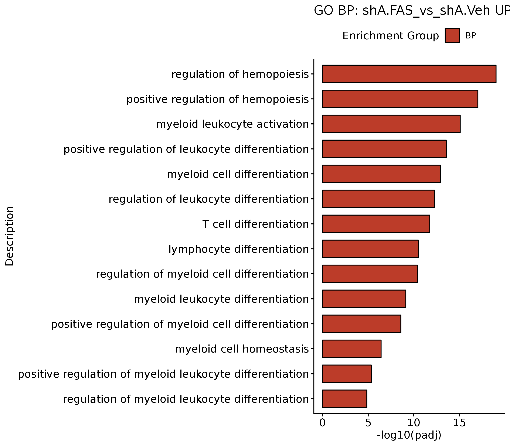
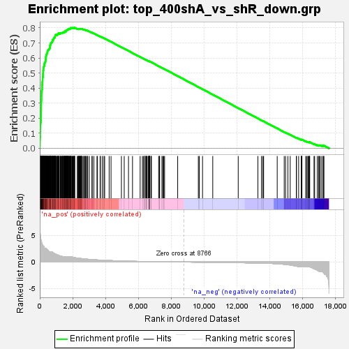

# ABCB8_Fig3

In this pipeline, we showed the detail codes in Fig3.

```
#load packages
library(Signac)
library(Seurat)
library(GenomicRanges)
library(future)
library(future.apply)
library(dplyr)
library(reticulate)
library(ReductionWrappers)
library(s2a)
library(cowplot)
library(ggplot2)
library(trqwe)
library(patchwork)
library(BuenColors)
library(paletteer)
library(ggsci)
library(AnnotationDbi)
library(org.Mm.eg.db)
library(org.Hs.eg.db)
library(clusterProfiler)
library(KEGG.db)
library(scCustomize)
library(Nebulosa)
library(SCP)
library(RColorBrewer)
library(ggpubr)
library(reshape2)
plan("multiprocess", workers = 10)
options(future.globals.maxSize = 200000 * 1024^2) # for 200 Gb RAM
```


#### Fig3G
```


selected_ptw <- c("regulation of hemopoiesis","positive regulation of hemopoiesis","myeloid leukocyte activation","positive regulation of leukocyte differentiation","myeloid cell differentiation","regulation of leukocyte differentiation","T cell differentiation","lymphocyte differentiation","regulation of myeloid cell differentiation","myeloid leukocyte differentiation","positive regulation of myeloid cell differentiation","myeloid cell homeostasis","positive regulation of myeloid leukocyte differentiation","regulation of myeloid leukocyte differentiation")
GO_up <- read.csv(row.names=1,"./workshop/RNAseq/Abcb8_zjn/FAS_RNASeq_20240813/DEG/GO_shA.FAS_vs_shA.Veh_up.csv")
GO_up$log10_padj <- -log10(GO_up$p.adjust)

tmp <- GO_up[which(GO_up$Description %in% selected_ptw),]

p1 <- ggbarplot(tmp, x = "Description", y = "log10_padj",
          fill = "ONTOLOGY",           # change fill color by mpg_level
          sort.val = "asc",          # Sort the value in descending order
          ylab = "-log10(padj)",
          legend.title = "Enrichment Group",
          rotate = TRUE,
          ggtheme = theme_pubr(),
          palette="nejm",
          title = "GO BP: shA.FAS_vs_shA.Veh UP"
          )

ggsave(height=7,width=8,"./workshop/RNAseq/Abcb8_zjn/github_code/GO.shA.FAS_vs_shA.Veh_up.png")


```



#### Fig3H
```
shA_all <- read.csv(row.names=1,file='./workshop/RNAseq/Abcb8_zjn/FAS_RNASeq_20240813/DEG/shAbcb8.FAS_vs_Veh.all.csv')
mmu.aml.rnk <- shA_all[order(shA_all$log2FoldChange,decreasing=T),]
mmu.aml.rnk$SYMBOL <- rownames(mmu.aml.rnk)
mmu.aml.rnk <- mmu.aml.rnk[,c("SYMBOL","log2FoldChange")]
write.table(mmu.aml.rnk,"./workshop/RNAseq/Abcb8_zjn/FAS_RNASeq_20240813/DEG/shA_FAS_vs_shA_Veh.rnk.txt",row.names=FALSE,col.names=FALSE,sep="\t",quote=FALSE)

shA_all <- read.csv(row.names=1,file='./workshop/RNAseq/Abcb8_zjn/new_RNASeq_20231228/shABCB8_vs_shRen_all.csv')
shA_vs_shR_p <- shA_all[which(shA_all$pvalue < 0.05),]
shA_vs_shR_DN_400 <- shA_vs_shR_p[order(shA_vs_shR_p$log2FoldChange,decreasing=FALSE),][1:400,]

##Then, Run GSEA prerank.

```



#### Fig3I
```

dds_all_normalize <- read.csv(row.names=1,"./raw_files/norm.counts.old_batch_plus_new_shRen_FAS_4.csv")

library(data.table)
top_400shA_vs_shR_down.grp <- fread("./top_400shA_vs_shR_down.grp.tsv")
top_400shA_vs_shR_down.grp <- as.data.frame(top_400shA_vs_shR_down.grp)
table(top_400shA_vs_shR_down.grp$`CORE ENRICHMENT`)

plot_data <- dds_all_normalize[top_400shA_vs_shR_down.grp[which(top_400shA_vs_shR_down.grp$`CORE ENRICHMENT` == "Yes"),]$SYMBOL,]
# plot_data <- dds_all_normalize[top_400shA_vs_shR_down.grp$SYMBOL,]
plot_data <- na.omit(plot_data)
plot_data <- plot_data[which(rowSums(plot_data) != 0),]

gene_order <- sample(rownames(plot_data))

plot_data_gene_ordered <- plot_data[gene_order, ]

library(circlize)
# 自定义颜色函数
col_fun <- colorRamp2(
  breaks = c(-1.5, -0.4, -0.1, 0.4, 1.5),   # break 点
  colors = c("#2166ac", "#f7fbff", "#fff5f0", "#d6604d", "#b2182b")  # 对应颜色
)

library(ComplexHeatmap)
library(BuenColors)
zscore <- log2(plot_data_gene_ordered[,]+1)
zscore <- na.omit(zscore)
zscore <- t(apply(zscore, 1, function(x) (x-mean(x))/sd(x)))
zscore <- na.omit(zscore)
zscore[zscore < -1.5] <- -1.5
zscore[zscore > 1.5] <- 1.5

p <- Heatmap(zscore, 
    cluster_rows = FALSE, 
    cluster_columns = FALSE, 
    right_annotation = NULL,
    left_annotation = NULL,
    show_row_names = FALSE,
    show_column_names = TRUE,
    col = col_fun,
    row_names_gp = gpar(fontsize = 12),
    top_annotation = NULL,
    bottom_annotation = NULL ,
    column_names_rot  = 90,
    row_names_side = "right",
    column_title = "GSEA core genes"
    )


```

