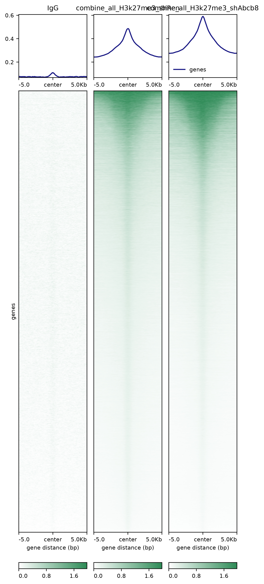
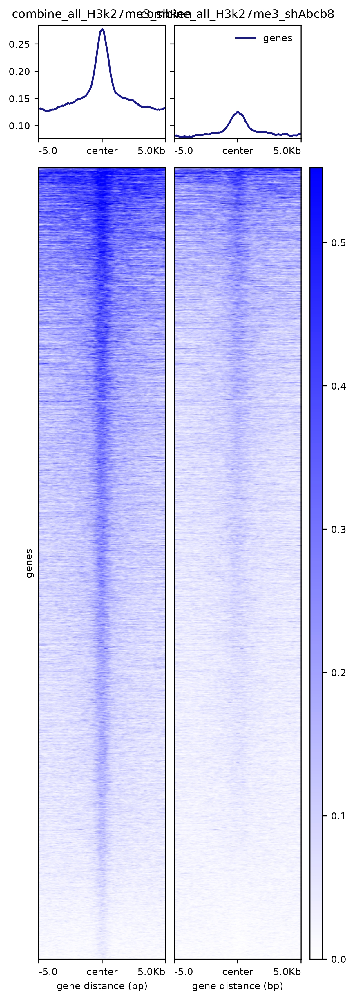
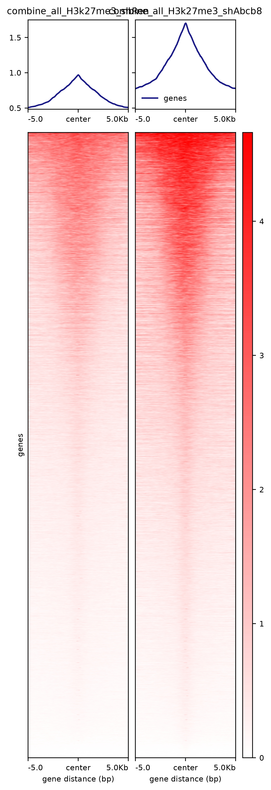
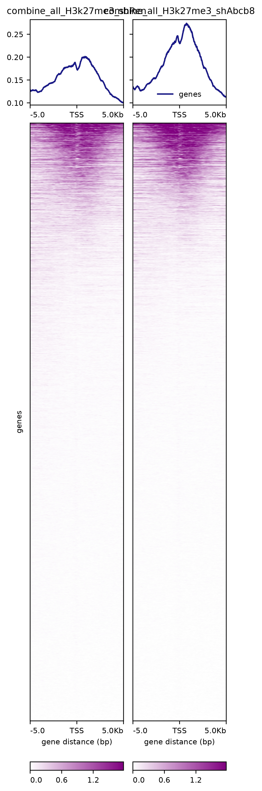
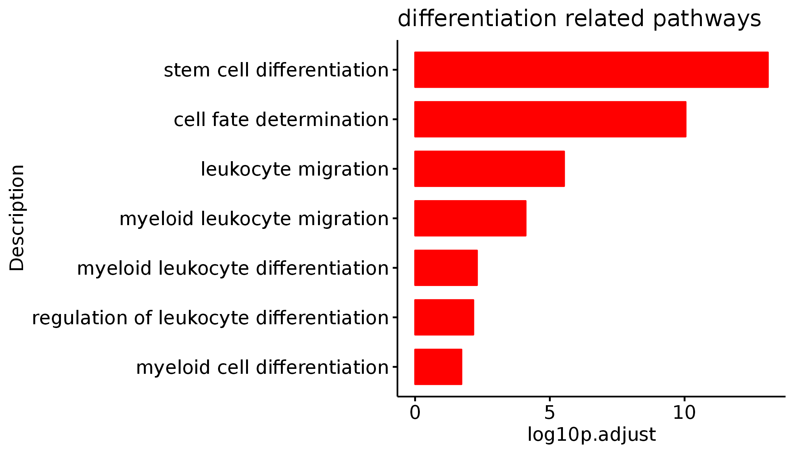
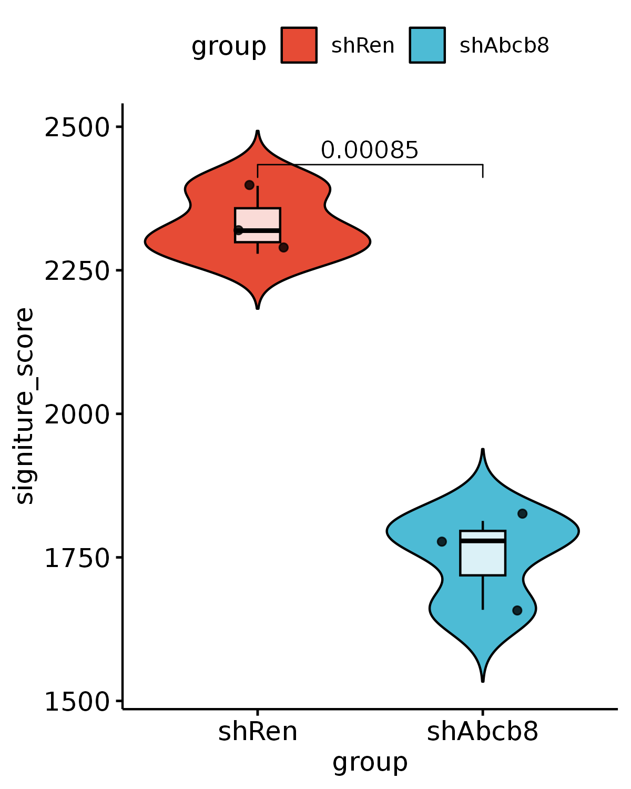
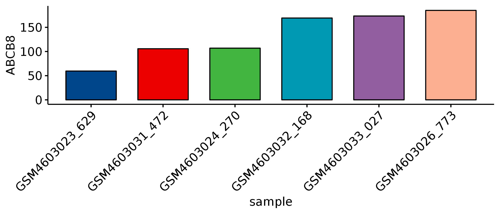
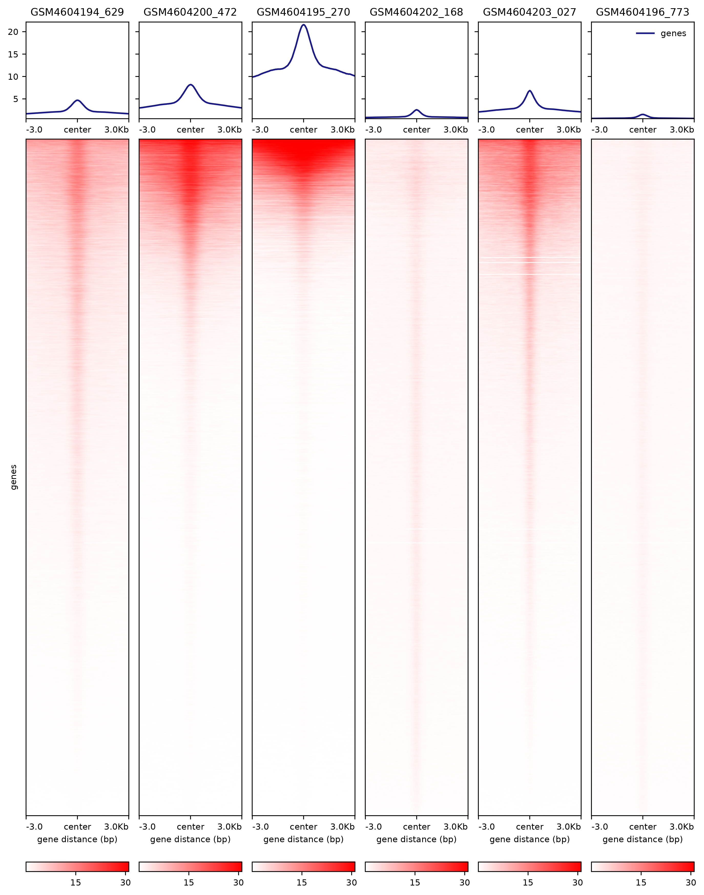

# ABCB8_Fig4 & S4

In this pipeline, we showed the detail codes in Fig4 & S4.

```
#load packages
library(Signac)
library(Seurat)
library(GenomicRanges)
library(future)
library(future.apply)
library(dplyr)
library(reticulate)
library(ReductionWrappers)
library(s2a)
library(cowplot)
library(ggplot2)
library(trqwe)
library(patchwork)
library(BuenColors)
library(paletteer)
library(ggsci)
library(AnnotationDbi)
library(org.Mm.eg.db)
library(org.Hs.eg.db)
library(clusterProfiler)
library(KEGG.db)
library(scCustomize)
library(Nebulosa)
library(SCP)
library(RColorBrewer)
library(ggpubr)
library(reshape2)
plan("multiprocess", workers = 10)
options(future.globals.maxSize = 200000 * 1024^2) # for 200 Gb RAM
```
#### Fig4E
```

files <- list.files(path = "/mnt/data/user_data/yiman/workshop/CUT-TAG/ABCB8/broad/", pattern = ".macs3.broad_peaks.gappedPeak$", full.names = TRUE) #批量导入文件名
name <- gsub(".macs3.broad_peaks.gappedPeak","",basename(files))
files <- files[13:25]
name <- name[13:25]

all_myPeaks <- future_lapply(files, ChIPQC:::GetGRanges, simple = TRUE)
names(all_myPeaks) <- name
consensusToCount <- XY_runConsensusRegions(GRangesList(all_myPeaks), "none")
consensusToCount <- as.data.frame(consensusToCount)
write.table(consensusToCount, file = "/mnt/data/user_data/yiman/workshop/CUT-TAG/ABCB8/for_figure/H3k27me3_consensusToCount.bed",
    sep="\t",col.names=FALSE,row.names=FALSE,quote=FALSE)
consensusToCount <- consensusToCount[which(consensusToCount$IgG == 0),]
write.table(consensusToCount, file = "/mnt/data/user_data/yiman/workshop/CUT-TAG/ABCB8/for_figure/H3k27me3_consensusToCount_rmIgG.bed",
    sep="\t",col.names=FALSE,row.names=FALSE,quote=FALSE)

computeMatrix reference-point --referencePoint center -b 5000 -a 5000 \
-R H3k27me3_consensusToCount_rmIgG.bed \
-S /mnt/data2/userdata/shuhao/project/yiman_work/ABCB8_CUTTAG/bw_files/IgG.bw combine_all_H3k27me3_shRen.bw combine_all_H3k27me3_shAbcb8.bw \
--numberOfProcessors 30 --skipZeros \
-o me3_shR_shA_binding_peaks_rmIgG_center_point.mat.gz 

plotHeatmap -m me3_shR_shA_binding_peaks_rmIgG_center_point.mat.gz \
 -out me3_shR_shA_binding_peaks_rmIgG_center_point.pdf \
 --colorList 'white,#2E8B57' 'white,#2E8B57' 'white,#2E8B57' 'white,#2E8B57' \
 --zMax 1.0 1.0 1.0 \
 --plotFileFormat "pdf"

```




#### Fig4F

```
me3_shA_vs_shR_all <- read.csv(row.names=1,file="/mnt/data/user_data/yiman/workshop/CUT-TAG/ABCB8/DEG/H3k27me3_shA_vs_shR_all.csv")
me3_shA_vs_shR_all$group <- ifelse(me3_shA_vs_shR_all$pvalue < 0.05 & abs(me3_shA_vs_shR_all$log2FoldChange) > 0.5, 
  ifelse(me3_shA_vs_shR_all$pvalue < 0.05 & me3_shA_vs_shR_all$log2FoldChange > 0.5, "UP", "DOWN"), "NS")
me3_shA_vs_shR_up <- me3_shA_vs_shR_all[which(me3_shA_vs_shR_all$pvalue < 0.05 & me3_shA_vs_shR_all$log2FoldChange > 0.5),]
me3_shA_vs_shR_down <- me3_shA_vs_shR_all[which(me3_shA_vs_shR_all$pvalue < 0.05 & me3_shA_vs_shR_all$log2FoldChange < -0.5),]

me3_shA_vs_shR_up <- rownames(me3_shA_vs_shR_up)
me3_shA_vs_shR_up <- str_split(me3_shA_vs_shR_up,"_")
me3_shA_vs_shR_up <- do.call(rbind,me3_shA_vs_shR_up)

me3_shA_vs_shR_down <- rownames(me3_shA_vs_shR_down)
me3_shA_vs_shR_down <- str_split(me3_shA_vs_shR_down,"_")
me3_shA_vs_shR_down <- do.call(rbind,me3_shA_vs_shR_down)

tmp <- rownames(me3_shA_vs_shR_all)
tmp <- str_split(tmp,"_")
tmp <- do.call(rbind,tmp)

write.table(me3_shA_vs_shR_up, file = "/mnt/data/user_data/yiman/workshop/CUT-TAG/ABCB8/for_figure/me3_shA_vs_shR_up.bed",
    sep="\t",col.names=FALSE,row.names=FALSE,quote=FALSE)

write.table(me3_shA_vs_shR_down, file = "/mnt/data/user_data/yiman/workshop/CUT-TAG/ABCB8/for_figure/me3_shA_vs_shR_down.bed",
    sep="\t",col.names=FALSE,row.names=FALSE,quote=FALSE)

write.table(tmp, file = "/mnt/data/user_data/yiman/workshop/CUT-TAG/ABCB8/for_figure/me3_shA_vs_shR_binding_peaks.bed",
    sep="\t",col.names=FALSE,row.names=FALSE,quote=FALSE)


computeMatrix reference-point --referencePoint center -b 5000 -a 5000 \
-R me3_shA_vs_shR_up_fc0.5.bed \
-S combine_all_H3k27me3_shRen.bw combine_all_H3k27me3_shAbcb8.bw \
--numberOfProcessors 30 --skipZeros \
-o me3_shR_shA_up_fc0.5_center_point.mat.gz 

plotHeatmap -m me3_shR_shA_up_fc0.5_center_point.mat.gz \
 -out me3_shR_shA_up_fc0.5_center_point.pdf \
 --colorList 'white, red' \
 --plotFileFormat "pdf"

computeMatrix reference-point --referencePoint center -b 5000 -a 5000 \
-R me3_shA_vs_shR_down_fc0.5.bed \
-S combine_all_H3k27me3_shRen.bw combine_all_H3k27me3_shAbcb8.bw \
--numberOfProcessors 30 --skipZeros \
-o me3_shR_shA_down_fc0.5_center_point.mat.gz 

plotHeatmap -m me3_shR_shA_down_fc0.5_center_point.mat.gz \
 -out me3_shR_shA_down_fc0.5_center_point.pdf \
 --colorList 'white, blue' \
 --plotFileFormat "pdf"


```




#### Fig4G

```
shA_vs_shR_all <- read.csv(row.names=1,file='/mnt/data/user_data/yiman/workshop/RNAseq/Abcb8_zjn/FAS_RNASeq_20240813/DEG/shAbcb8_vs_shRen.all.csv')
shA_vs_shR_all$group <- as.factor(ifelse(abs(shA_vs_shR_all$log2FoldChange) > 0 & shA_vs_shR_all$pvalue < 0.05, ifelse(shA_vs_shR_all$log2FoldChange > 0 ,'Up','Down'),'NS'))
table(shA_vs_shR_all$group)
shA_vs_shR_down <- shA_vs_shR_all[which(shA_vs_shR_all$group == "Down"),]
shA_vs_shR_down.sig <- rownames(shA_vs_shR_down)

shA_vs_shR_down.sig_refseq <- unlist(mapIds(x = org.Mm.eg.db,keys = shA_vs_shR_down.sig,keytype ="SYMBOL",column ="REFSEQ",multiVals="first"),use.names=FALSE)
shA_vs_shR_down.sig_refseq <- na.omit(shA_vs_shR_down.sig_refseq)
write.table(shA_vs_shR_down.sig_refseq,"/mnt/data/user_data/yiman/workshop/RNAseq/Abcb8_zjn/FAS_RNASeq_20240813/DEG/shA_vs_shR_down.sig.fc0_refseq.txt",row.names=FALSE,col.names=FALSE,quote=FALSE)
cd /mnt/data/user_data/yiman/workshop/RNAseq/Abcb8_zjn/FAS_RNASeq_20240813/DEG/
awk 'NR==FNR{a[$0];next}{split($4,b,"."); if(b[1] in a) print $0}' shA_vs_shR_down.sig.fc0_refseq.txt /mnt/data/user_data/yiman/workshop/ATAC_Seq/ucsc_ref/mm10.ucsc.refseq.bed > shA_vs_shR_down.sig.fc0_genes.bed

cd /mnt/data/user_data/yiman/workshop/CUT-TAG/ABCB8/bw_files/

 computeMatrix reference-point --referencePoint TSS -b 5000 -a 5000 \
-R /mnt/data/user_data/yiman/workshop/RNAseq/Abcb8_zjn/FAS_RNASeq_20240813/DEG/shA_vs_shR_down.sig.fc0_genes.bed \
-S combine_all_H3k27me3_shRen.bw combine_all_H3k27me3_shAbcb8.bw  \
--numberOfProcessors 30 --skipZeros \
-o /mnt/data/user_data/yiman/workshop/CUT-TAG/ABCB8/DEG/TSS.me3.shA_vs_shR_down.sig.fc0.mat.gz 

plotHeatmap -m /mnt/data/user_data/yiman/workshop/CUT-TAG/ABCB8/DEG/TSS.me3.shA_vs_shR_down.sig.fc0.mat.gz \
 -out /mnt/data/user_data/yiman/workshop/CUT-TAG/ABCB8/DEG/TSS.me3.shA_vs_shR_down.fc0.sig.pdf \
 --colorList 'white,purple' 'white,purple' 'white,purple' 'white,purple' 'white,purple' 'white,purple' 'white,purple' 

```



#### FigS4G

```


me3_shA_vs_shR_all <- read.csv(row.names=1,file="/mnt/data/user_data/yiman/workshop/CUT-TAG/ABCB8/DEG/H3k27me3_shA_vs_shR_all.csv")
me3_shA_vs_shR_promoter <- me3_shA_vs_shR_all[grepl("Promoter",me3_shA_vs_shR_all$annotation),]
table(me3_shA_vs_shR_promoter$annotation)

me3_shA_vs_shR_promoter_up <- me3_shA_vs_shR_promoter[which(me3_shA_vs_shR_promoter$pvalue < 0.05 & 
    me3_shA_vs_shR_promoter$log2FoldChange > 1),]
nrow(me3_shA_vs_shR_promoter_up) #1238
length(unique(me3_shA_vs_shR_promoter_up$SYMBOL)) #962

aa <- unique(me3_shA_vs_shR_promoter_up$geneId)

GO_up <- enrichGO(gene = aa, 
             OrgDb = org.Mm.eg.db,
        ont = "all", 
                 pvalueCutoff = 0.05, 
                     pAdjustMethod = "BH", 
                     qvalueCutoff = 1,
                     minGSSize = 10, 
                     maxGSSize = 500, 
                     readable = T, 
                     pool = FALSE)

write.csv(GO_up,file="/mnt/data/user_data/yiman/workshop/CUT-TAG/ABCB8/DEG/GO_H3k27me3_shA_vs_shR_up.csv")

GO_up <- read.csv("/mnt/data/user_data/yiman/workshop/CUT-TAG/ABCB8/DEG/GO_H3k27me3_shA_vs_shR_up.csv",row.names=1)
GO_up$log10p.adjust <- -log10(GO_up$p.adjust)
stem_diff <- c("stem cell differentiation","cell fate determination","leukocyte migration","myeloid leukocyte migration","myeloid leukocyte differentiation","regulation of leukocyte differentiation","myeloid cell differentiation")

p <- ggbarplot(GO_up[which(GO_up$Description %in% stem_diff),],x="Description",y="log10p.adjust",orientation = "horiz",color = "red",
  fill="red",sort.val = "asc",title="differentiation related pathways")

ggsave(height=4,"/mnt/data/user_data/yiman/workshop/RNAseq/Abcb8_zjn/github_code/GO.H3k27me3.up.diff.png")

```




#### Fig4H

```

GO_up <- read.csv("/mnt/data/user_data/yiman/workshop/CUT-TAG/ABCB8/DEG/GO_H3k27me3_shA_vs_shR_up.csv",row.names=1)
GO_up$log10p.adjust <- -log10(GO_up$p.adjust)
stem_diff <- c("stem cell differentiation","cell fate determination","leukocyte migration","myeloid leukocyte migration","myeloid leukocyte differentiation","regulation of leukocyte differentiation","myeloid cell differentiation")

stem_diff_gene <- GO_up[which(GO_up$Description %in% stem_diff),]
stem_diff_gene <- as.character(stem_diff_gene$geneID)
stem_diff_gene <- str_split(stem_diff_gene,"/")
stem_diff_gene <- unlist(stem_diff_gene,use.names=FALSE)
stem_diff_gene <- unique(stem_diff_gene)

res_ckit_all <- read.csv(file="/mnt/data/user_data/yiman/workshop/RNAseq/Abcb8_zjn/new_RNASeq_20231228/shABCB8_vs_shRen_all.csv",row.names=1)

signiture_frame <- res_ckit_all[c(stem_diff_gene),c(7:12)]
signiture_frame <- na.omit(signiture_frame)
signiture_frame <- t(signiture_frame)
signiture_frame <- as.data.frame(signiture_frame)
signiture_frame$signiture_score <- rowMeans(signiture_frame)
signiture_frame$group <- c(rep("shRen",3),rep("shAbcb8",3))
signiture_frame <- signiture_frame[,(ncol(signiture_frame)-1):ncol(signiture_frame)]
signiture_frame$sample <- rownames(signiture_frame)

p1 <- ggviolin(signiture_frame, "group", "signiture_score", fill = "group",
   palette = "npg",add = c("boxplot","jitter"), add.params = list(fill = "white",alpha=0.8)) +
  stat_compare_means(comparisons=list(c("shRen","shAbcb8")),method="t.test") 

ggsave(width=4,height=5,"/mnt/data/user_data/yiman/workshop/RNAseq/Abcb8_zjn/github_code/violin.me3.up.diff.ptw.png")


```




#### Fig4M

```

dds_AML_normalize <- read.csv(row.names=1,file='/mnt/data/user_data/yiman/workshop/CUT-TAG/ABCB8/human_files/Nature_2022/outs/DESeq2.norm.AML.reorder.csv')

ABCB8.norm.exp <- dds_AML_normalize["ABCB8",]
ABCB8.norm.exp <- t(ABCB8.norm.exp)
ABCB8.norm.exp <- as.data.frame(ABCB8.norm.exp)
ABCB8.norm.exp$tmp <- ABCB8.norm.exp[,1]
ABCB8.norm.exp <- ABCB8.norm.exp[order(ABCB8.norm.exp$ABCB8),]
mean(ABCB8.norm.exp$ABCB8)
ABCB8.AML.mean.high <- rownames(ABCB8.norm.exp[which(ABCB8.norm.exp$ABCB8 > mean(ABCB8.norm.exp$ABCB8)),])
ABCB8.AML.mean.low <- rownames(ABCB8.norm.exp[which(ABCB8.norm.exp$ABCB8 < mean(ABCB8.norm.exp$ABCB8)),])
ABCB8.norm.exp$group <- ifelse(rownames(ABCB8.norm.exp) %in% ABCB8.AML.mean.high,"ABCB8_high","ABCB8_low")
ABCB8.norm.exp.final <- ABCB8.norm.exp[c(2,4,5,12,13,14),]
ABCB8.norm.exp.final$sample <- rownames(ABCB8.norm.exp.final)

p <- ggbarplot(ABCB8.norm.exp.final,x="sample",y="ABCB8",fill="sample",palette="lancet",
  add = c(), label = FALSE, lab.vjust = -1.6) + NoLegend() + RotatedAxis()

ggsave(height=3,"/mnt/data/user_data/yiman/workshop/RNAseq/Abcb8_zjn/github_code/barplot.ABCB8.final.3vs3.samples.png")


setwd("/mnt/data/user_data/yiman/workshop/CUT-TAG/ABCB8/human_files/Nature_2022/CUTTGA/")
CUTTGA.files <- list.files("/mnt/data/user_data/yiman/workshop/CUT-TAG/ABCB8/human_files/Nature_2022/CUTTGA/",pattern=".txt")
H3k27me3.CUTTGA.files <- CUTTGA.files[c(15,21,16,23,24,17)]
H3k27me3.CUTTGA.name <- gsub('_CUT_TAG_H3K27me3.MACS2.filt.peaks.txt','',H3k27me3.CUTTGA.files)

narrow_list <- list()
for (i in 1:6) {
  peakAnno <- read.table(H3k27me3.CUTTGA.files[i],header=FALSE)
  colnames(peakAnno)[1:3] <- c("chr","start","end")
  narrow_list[[i]] <- peakAnno
}
names(narrow_list) <- H3k27me3.CUTTGA.name
consensusToCount <- XY_runConsensusRegions(GRangesList(narrow_list), "none") #90324 peaks
write.table(consensusToCount, file = "/mnt/data/user_data/yiman/workshop/CUT-TAG/ABCB8/human_files/Nature_2022/outs/peaks.H3k27me3.final.3vs3.sample.bed",
    sep="\t",col.names=FALSE,row.names=FALSE,quote=FALSE)

cd /mnt/data/user_data/yiman/workshop/CUT-TAG/ABCB8/human_files/Nature_2022/CUTTGA/

computeMatrix reference-point --referencePoint center -b 3000 -a 3000 \
-R /mnt/data/user_data/yiman/workshop/CUT-TAG/ABCB8/human_files/Nature_2022/outs/peaks.H3k27me3.final.3vs3.sample.bed \
-S GSM4604194_629.bigwig GSM4604200_472.bigwig GSM4604195_270.bigwig GSM4604202_168.bigwig GSM4604203_027.bigwig  GSM4604196_773.bigwig \
--numberOfProcessors 30 --skipZeros \
-o /mnt/data/user_data/yiman/workshop/CUT-TAG/ABCB8/human_files/Nature_2022/outs/peaks.H3k27me3.final.3vs3.samples.mat.gz 

plotHeatmap -m /mnt/data/user_data/yiman/workshop/CUT-TAG/ABCB8/human_files/Nature_2022/outs/peaks.H3k27me3.final.3vs3.samples.mat.gz \
 -out /mnt/data/user_data/yiman/workshop/CUT-TAG/ABCB8/human_files/Nature_2022/outs/peaks.H3k27me3.final.3vs3.samples.pdf \
 --colorList 'white, red' 'white, red' 'white, red' 'white, red' 'white, red' 'white, red' 'white, red' 'white, red' 'white, red' 'white, red' 'white, red' \
 --plotFileFormat "pdf" \
 --missingDataColor "white"


```




