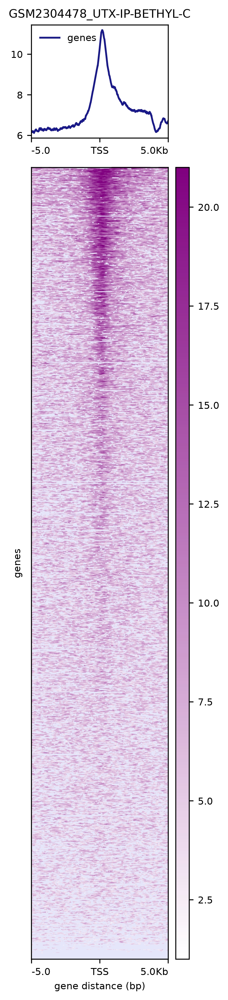
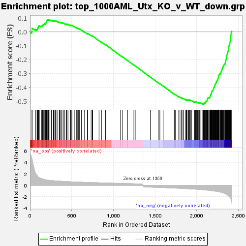
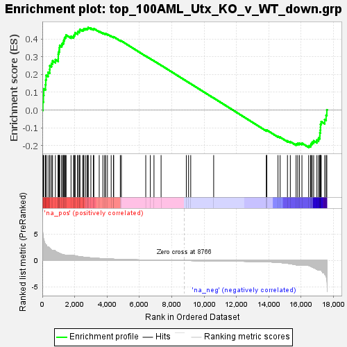
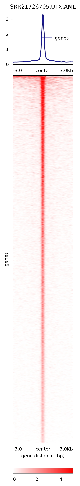
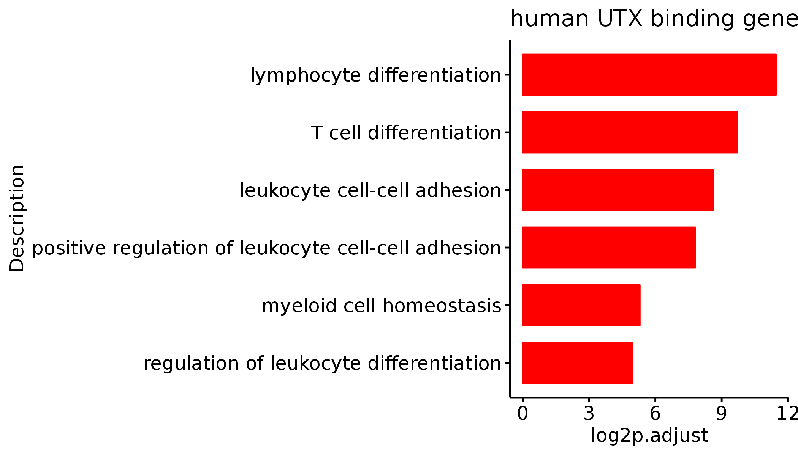
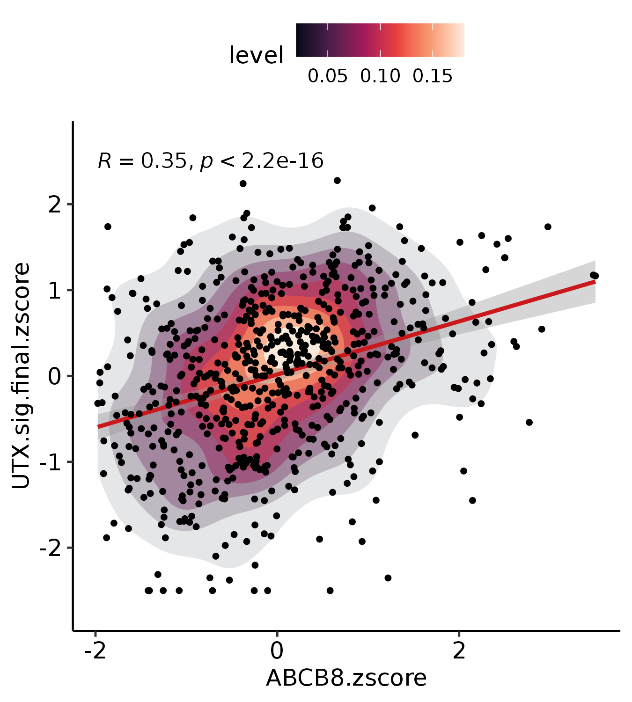

# ABCB8_Fig5

In this pipeline, we showed the detail codes in Fig5.

```
#load packages
library(Signac)
library(Seurat)
library(GenomicRanges)
library(future)
library(future.apply)
library(dplyr)
library(reticulate)
library(ReductionWrappers)
library(s2a)
library(cowplot)
library(ggplot2)
library(trqwe)
library(patchwork)
library(BuenColors)
library(paletteer)
library(ggsci)
library(AnnotationDbi)
library(org.Mm.eg.db)
library(org.Hs.eg.db)
library(clusterProfiler)
library(KEGG.db)
library(scCustomize)
library(Nebulosa)
library(SCP)
library(RColorBrewer)
library(ggpubr)
library(reshape2)
plan("multiprocess", workers = 10)
options(future.globals.maxSize = 200000 * 1024^2) # for 200 Gb RAM
```

#### Fig5A
```


me3_shA_vs_shR_all <- read.csv(row.names=1,file="/mnt/data/user_data/yiman/workshop/CUT-TAG/ABCB8/DEG/H3k27me3_shA_vs_shR_all.csv")
me3_shA_vs_shR_all$group <- ifelse(me3_shA_vs_shR_all$pvalue < 0.05 & abs(me3_shA_vs_shR_all$log2FoldChange) > 0.5, 
  ifelse(me3_shA_vs_shR_all$pvalue < 0.05 & me3_shA_vs_shR_all$log2FoldChange > 0.5, "UP", "DOWN"), "NS")
me3_shA_vs_shR_up <- me3_shA_vs_shR_all[which(me3_shA_vs_shR_all$pvalue < 0.05 & me3_shA_vs_shR_all$log2FoldChange > 0.5),]
me3_shA_vs_shR_down <- me3_shA_vs_shR_all[which(me3_shA_vs_shR_all$pvalue < 0.05 & me3_shA_vs_shR_all$log2FoldChange < -0.5),]
nrow(me3_shA_vs_shR_up)
nrow(me3_shA_vs_shR_down)
table(me3_shA_vs_shR_all$group)
length(unique(me3_shA_vs_shR_up$SYMBOL))
length(unique(me3_shA_vs_shR_down$SYMBOL))

me3_shA_vs_shR_up_refseq <- unlist(mapIds(x = org.Mm.eg.db,keys = as.character(unique(me3_shA_vs_shR_up$SYMBOL)),keytype ="SYMBOL",column ="REFSEQ",multiVals="first"),use.names=FALSE)
me3_shA_vs_shR_up_refseq <- na.omit(me3_shA_vs_shR_up_refseq)
write.table(me3_shA_vs_shR_up_refseq,"/mnt/data/user_data/yiman/workshop/CUT-TAG/ABCB8/UTX_CHIP/me3_shA_vs_shR_up_refseq.txt",row.names=FALSE,col.names=FALSE,quote=FALSE)
cd /mnt/data/user_data/yiman/workshop/CUT-TAG/ABCB8/UTX_CHIP/
awk 'NR==FNR{a[$0];next}{split($4,b,"."); if(b[1] in a) print $0}' me3_shA_vs_shR_up_refseq.txt /mnt/data/user_data/yiman/workshop/ATAC_Seq/ucsc_ref/mm10.ucsc.refseq.bed > me3_shA_vs_shR_up_refseq.bed

cd /mnt/data/user_data/yiman/workshop/CUT-TAG/ABCB8/UTX_CHIP/

computeMatrix reference-point --referencePoint TSS -b 5000 -a 5000 \
-R me3_shA_vs_shR_up_refseq.bed \
-S GSM2304478_UTX-IP-BETHYL-C.bw \
--numberOfProcessors 30 --skipZeros \
-o me3_shR_shA_DEG_fc0.5_UTX_TSS.mat.gz 

plotHeatmap -m me3_shR_shA_DEG_fc0.5_UTX_TSS.mat.gz \
 -out me3_shR_shA_DEG_fc0.5_UTX_TSS.pdf \
 --colorList 'white, purple' \
 --missingDataColor "#E6E6FA" \
 --plotFileFormat "pdf"


```




#### Fig5C & D
```

AML_Utx_KO_v_WT_result <- read.csv(row.names=1,file="/mnt/data/user_data/yiman/workshop/RNAseq/Abcb8_zjn/mimic_utx_from_zl/Utx_05_KO_v_WT_count_DEseqnormalize_symbol_and_anno.csv")
AML_Utx_KO_v_WT_result_p <- AML_Utx_KO_v_WT_result[which(AML_Utx_KO_v_WT_result$KO_v_WT_pvalue < 0.05),]

for (i in 1:10) {
  human_up <- AML_Utx_KO_v_WT_result_p[order(AML_Utx_KO_v_WT_result_p$KO_v_WT_log2FoldChange,decreasing=TRUE),]
  human_dn <- AML_Utx_KO_v_WT_result_p[order(AML_Utx_KO_v_WT_result_p$KO_v_WT_log2FoldChange),]
  file_name1 <- paste0("top_",(i*100),'AML_Utx_KO_v_WT_up.grp')
  write.table(rownames(human_up[1:(i*100),]),file = paste0('/mnt/data/user_data/yiman/workshop/RNAseq/Abcb8_zjn/DEG_out/',file_name1),row.names = FALSE,quote = FALSE)
  file_name2 <- paste0("top_",(i*100),'AML_Utx_KO_v_WT_down.grp')
  write.table(rownames(human_dn[1:(i*100),]),file = paste0('/mnt/data/user_data/yiman/workshop/RNAseq/Abcb8_zjn/DEG_out/',file_name2),row.names = FALSE,quote = FALSE)
}

res_ckit_all <- read.csv(file='/mnt/data/user_data/yiman/workshop/RNAseq/Abcb8_zjn/DEG_out/res_ckit_sh_ren_all.csv',row.names=1)

#rnk
res_ckit_all$symbol <- rownames(res_ckit_all)
mouse_up <- res_ckit_all[order(res_ckit_all$log2FoldChange,decreasing=TRUE),]
mouse_dn <- res_ckit_all[order(res_ckit_all$log2FoldChange),]
write.csv(mouse_up[,c(27,20)],file='/mnt/data/user_data/yiman/workshop/RNAseq/Abcb8_zjn/DEG_out/ckit_rnk_no_p_filt.csv',row.names = FALSE,quote = FALSE)

#Then, run GSEA prerank.

```





#### Fig5G
```


cd /mnt/data/user_data/yiman/workshop/CUT-TAG/ABCB8/human_files/Leukemia_2023/

computeMatrix reference-point --referencePoint center -b 3000 -a 3000 \
-R SRR21726705.UTX.AML.macs3.narrow_peaks.narrowPeak \
-S SRR21726705.UTX.AML.bw \
--numberOfProcessors 30 --skipZeros \
-o UTX.AML.all.peaks.center.mat.gz 

plotHeatmap -m UTX.AML.all.peaks.center.mat.gz \
 -out UTX.AML.all.peaks.center.pdf \
 --colorList 'white, red' 'white, red' 'white, red' 'white, red' 'white, red' 'white, red' 'white, red' 'white, red' 'white, red' 'white, red' 'white, red' \
 --missingDataColor "white" \
 --plotFileFormat "pdf" \
 --zMax 5

```




#### Fig5H
```


UTX.CHIP.human <- read.csv(row.names=1,"/mnt/data/user_data/yiman/workshop/CUT-TAG/ABCB8/human_files/Leukemia_2023/SRR21726705.UTX.AML_peak.anno.csv")

UTX.CHIP.human$SYMBOL <- as.character(UTX.CHIP.human$SYMBOL)
UTX.CHIP.human$entrez <- mapIds(x = org.Hs.eg.db,
          keys = UTX.CHIP.human$SYMBOL,
          keytype ="SYMBOL",
          column ="ENTREZID",
          multiVals="first")

GO_up <- enrichGO(gene = tmp$entrez, 
             OrgDb = org.Hs.eg.db,
        ont = "all", 
                 pvalueCutoff = 0.05, 
                     pAdjustMethod = "BH", 
                     qvalueCutoff = 1,
                     minGSSize = 10, 
                     maxGSSize = 500, 
                     readable = T, 
                     pool = FALSE)

write.csv(GO_up,"/mnt/data/user_data/yiman/workshop/CUT-TAG/ABCB8/human_files/Leukemia_2023/GO_SRR21726705.UTX.AML_peak.csv")

GO_up <- read.csv("/mnt/data/user_data/yiman/workshop/CUT-TAG/ABCB8/human_files/Leukemia_2023/GO_SRR21726705.UTX.AML_peak.csv",row.names=1)
GO_up$log2p.adjust <- -log2(GO_up$p.adjust)
GO_up$log10p <- -log10(GO_up$pvalue)
stem_diff <- c("regulation of leukocyte differentiation","myeloid cell homeostasis","positive regulation of leukocyte cell-cell adhesion","leukocyte cell-cell adhesion","T cell differentiation","lymphocyte differentiation")

p <- ggbarplot(GO_up[which(GO_up$Description %in% stem_diff),],x="Description",y="log2p.adjust",orientation = "horiz",color = "red",
  fill="red",sort.val = "asc",title="human UTX binding genes")

ggsave(height=4,"/mnt/data/user_data/yiman/workshop/RNAseq/Abcb8_zjn/github_code/GO.RR21726705.UTX.AML.png")


```




#### Fig5I
```


UTX.CHIP.human <- read.csv(row.names=1,"/mnt/data/user_data/yiman/workshop/CUT-TAG/ABCB8/human_files/Leukemia_2023/SRR21726705.UTX.AML_peak.anno.csv")
UTX.CHIP.human.sig <- unique(as.character(UTX.CHIP.human$SYMBOL))
write.csv(UTX.CHIP.human.sig,"/mnt/data/user_data/yiman/workshop/CUT-TAG/ABCB8/human_files/Leukemia_2023/UTX.CHIP.human.Leukemia.sig.csv")

setwd("/mnt/data/user_data/yiman/workshop/RNAseq/Abcb8_zjn/human_data/aml_ohsu_2022/BeatAML")
BeatAML.obj <- mcreadRDS("./DEG_outs/BeatAML.Seurat.obj.rds", mc.cores = 20)

all_gene <- rownames(BeatAML.obj@assays$RNA)
UTX.sig.final_ <- intersect(unique(as.character(UTX.CHIP.human$SYMBOL)),all_gene)
all.counts <- FetchData(object = BeatAML.obj, vars = c(UTX.sig.final_,"Group","sample","ABCB8"),slot="data")
all.counts$UTX.sig.final <- rowMeans(all.counts[,1:5702])
all.counts <- all.counts[,c("ABCB8","UTX.sig.final")]

all.counts$ABCB8.zscore <- (all.counts$ABCB8 - mean(all.counts$ABCB8)) / sd(all.counts$ABCB8)
all.counts$UTX.sig.final.zscore <- (all.counts$UTX.sig.final - mean(all.counts$UTX.sig.final)) /  sd(all.counts$UTX.sig.final)
# all.counts[which(all.counts$UTX.sig.final.zscore > 2.5),]$UTX.sig.final.zscore <- 2.5
all.counts[which(all.counts$UTX.sig.final.zscore < -2.5),]$UTX.sig.final.zscore <- -2.5
all.counts[which(all.counts$ABCB8.zscore > 3.5),]$ABCB8.zscore <- 3.5

p <- ggplot(data=all.counts,aes(x=ABCB8.zscore,y=UTX.sig.final.zscore)) 
p <- p + stat_density2d(aes(fill=..level..,alpha=..level..),geom='polygon')+
  scale_fill_viridis_c(option = "F")+
  geom_smooth(method=lm,colour="#cb181d",se=TRUE)+
  guides(alpha="none")+
  geom_point(color="black",size=1) + theme_pubr()+
  stat_cor(color="black", method = c("spearman")) + ylim(-2.7,2.7)

ggsave(width=4.5,height=5,"/mnt/data/user_data/yiman/workshop/RNAseq/Abcb8_zjn/github_code/scatter.ABCB8.UTX.human.zscore.png")


```




