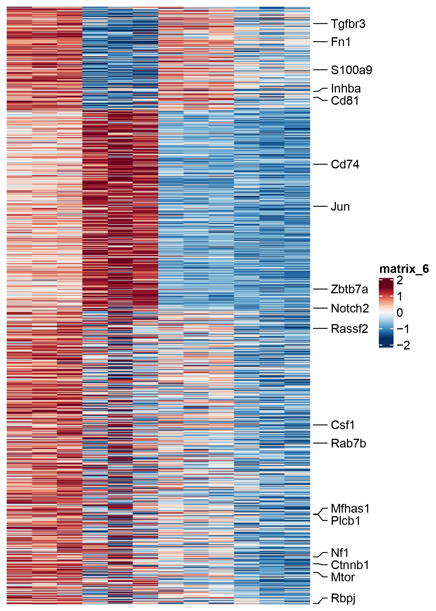
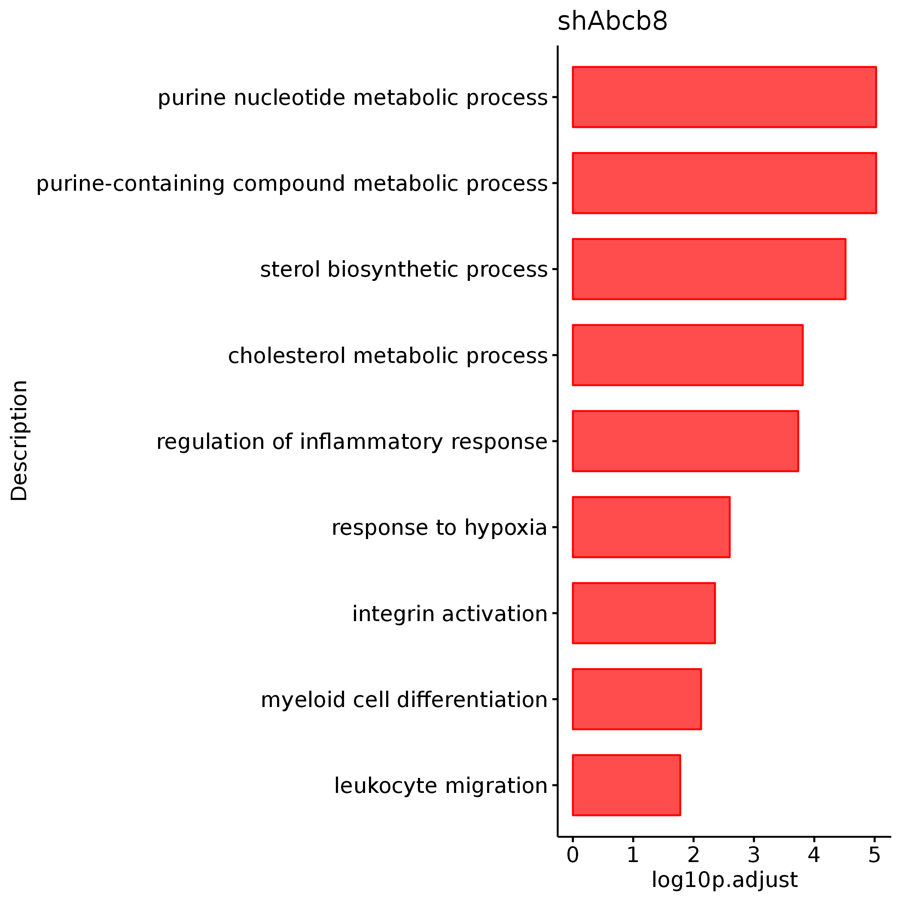
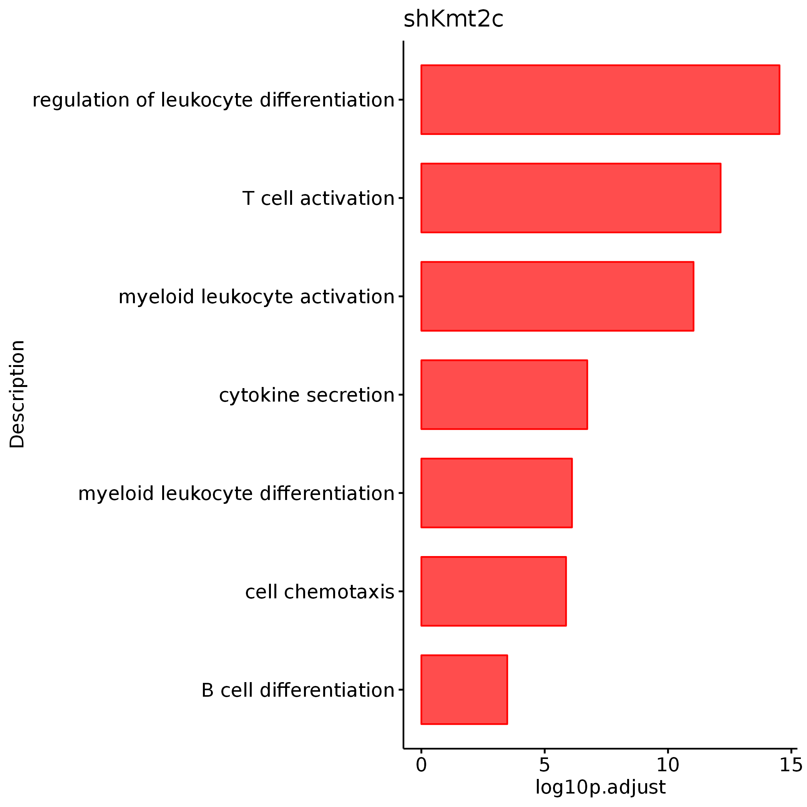
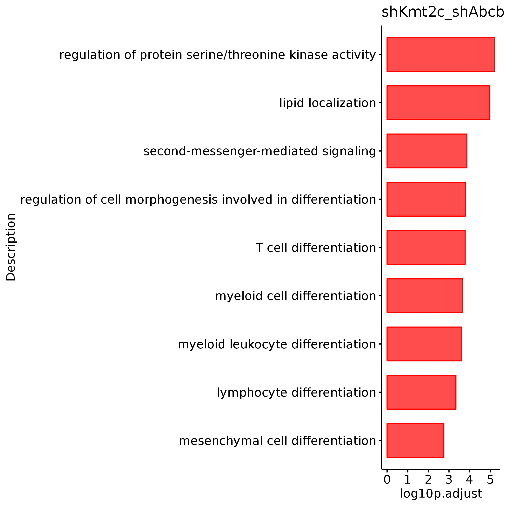
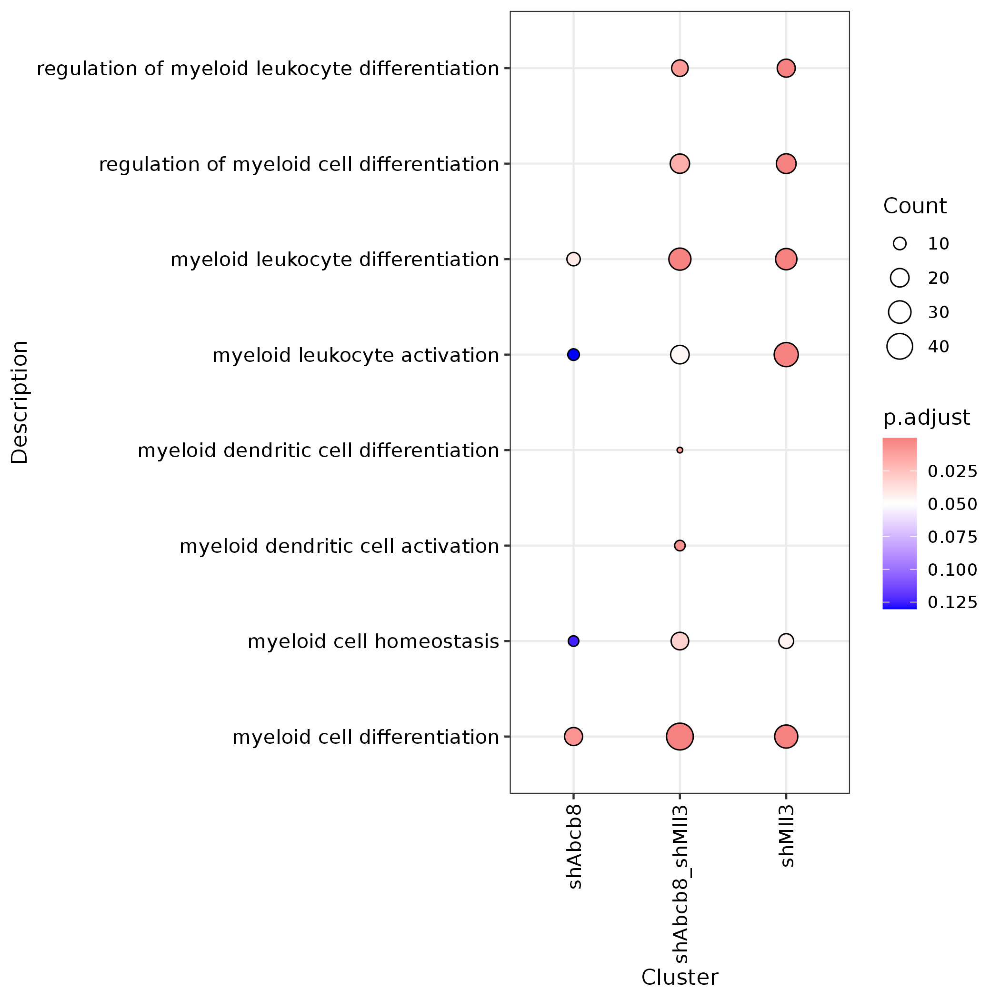
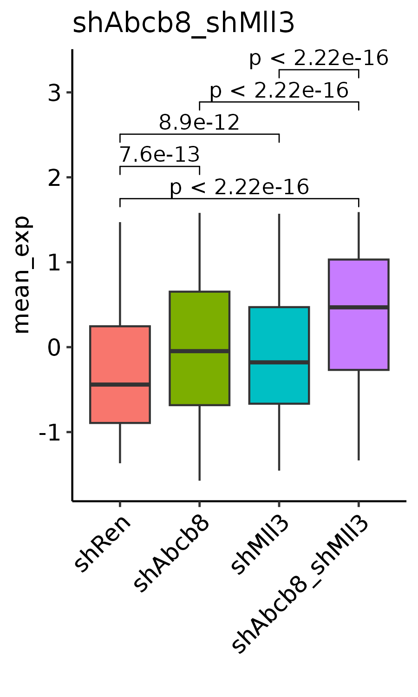

# ABCB8_Fig6

In this pipeline, we showed the detail codes in Fig6.

```
#load packages
library(Signac)
library(Seurat)
library(GenomicRanges)
library(future)
library(future.apply)
library(dplyr)
library(reticulate)
library(ReductionWrappers)
library(s2a)
library(cowplot)
library(ggplot2)
library(trqwe)
library(patchwork)
library(BuenColors)
library(paletteer)
library(ggsci)
library(AnnotationDbi)
library(org.Mm.eg.db)
library(org.Hs.eg.db)
library(clusterProfiler)
library(KEGG.db)
library(scCustomize)
library(Nebulosa)
library(SCP)
library(RColorBrewer)
library(ggpubr)
library(reshape2)
plan("multiprocess", workers = 10)
options(future.globals.maxSize = 200000 * 1024^2) # for 200 Gb RAM
```

#### Fig6E
```

annotation_row <- read.csv(row.names=1,"/mnt/data/user_data/yiman/workshop/RNAseq/Abcb8_zjn/new_RNASeq_20231228/annotation_row_down_onlymus_v3.csv")

shMll3_shA_all <- read.csv(row.names=1,'/mnt/data/user_data/yiman/workshop/RNAseq/Abcb8_zjn/new_RNASeq_20231228/shAbcb8_shMLL3_vs_shRen_all.csv')
dds_all_normalize <- read.csv(row.names=1,file='/mnt/data/user_data/yiman/workshop/RNAseq/Abcb8_zjn/new_RNASeq_20231228/shABCB8_MLL3_all_norm_counts.csv')

mll3_abcb8_ren_rna_dn <- subset(shMll3_shA_all,pvalue < 0.05 & log2FoldChange < 0)
mll3_abcb8_ren_rna_dn <- unique(rownames(mll3_abcb8_ren_rna_dn))

all_counts <- dds_all_normalize[mll3_abcb8_ren_rna_dn,]
dynamic_counts <- log(all_counts+1,2)  #log2(differentiation_genesets+1)
zscore <- t(apply(dynamic_counts, 1, function(x) (x-mean(x))/sd(x)))
zscore[zscore < -1.5] <- -1.5
zscore[zscore > 1.5] <- 1.5
zscore <- na.omit(zscore)
annotation_col <- data.frame(Group=c(rep("shRen",3),rep("shAbcb8",3),rep("shMll3",3),rep("shAbcb8_shMll3",3)),row.names=colnames(zscore))
annotation_col$Group <- factor(annotation_col$Group,levels=c("shRen","shAbcb8","shMll3","shAbcb8_shMll3"))
aa <- jdb_palette("brewer_yes")[1:length(jdb_palette("brewer_spectra"))]

df <- annotation_row
df$gene <- rownames(annotation_row)
df_shuffled <- df %>%
  group_by(Cluster2) %>%
  sample_n(size = n(), replace = FALSE) %>%
  ungroup()
df_shuffled <- as.data.frame(df_shuffled)
rownames(df_shuffled) <- df_shuffled$gene
df_shuffled <- df_shuffled[,-3]
df_shuffled$Cluster2 <- factor(df_shuffled$Cluster2,levels=c("shAbcb8","shMll3","shAbcb8_shMll3"))
df_shuffled <- df_shuffled[order(df_shuffled$Cluster2),]

zscore_3 <- zscore[rownames(df_shuffled),]

order <- as.data.frame(table(df_shuffled$Cluster))
order_ <- future_lapply(1:(nrow(order)-1),function(x) {
    return(sum(order$Freq[1:x]))
    })
order <- unlist(order_)
zscore_3[zscore_3 < -1.5] <- -1.5
zscore_3[zscore_3 > 1.5] <- 1.5

only_abcb8_marker_gene <- c("Inhba","Tgfbr3","Cd81","Cd11b","Fn1","S100a9")
only_Mll3_marker_gene <- c("Cd74","Runx1","Cbfa2t2","Jun","Zbtb7a")
abcb8_mll3_marker_gene <- c("Mtor","Mfhas1","Plcb1","Nf1","Rab7b","Rassf2","Notch2","Rbpj","Ctnnb1","Csf1")

gene <- c(only_abcb8_marker_gene,only_Mll3_marker_gene,abcb8_mll3_marker_gene)
genemark <- which(rownames(zscore_3) %in% gene)
labs <- rownames(zscore_3)[genemark]
ha1 <-  rowAnnotation(
  foo = anno_mark(at = genemark,
  labels = labs,
  labels_gp = gpar(fontsize = 10)
  ))

p <- Heatmap(zscore_3, 
        cluster_rows = FALSE, 
        cluster_columns = FALSE, 
        right_annotation = ha1,
        left_annotation = NULL,
        show_row_names = FALSE,
        show_column_names = FALSE,
        col = colorRampPalette(aa)(100)
        )

png(height=100,width=50,"/mnt/data/user_data/yiman/workshop/RNAseq/Abcb8_zjn/github_code/Fig6E.png")
p
dev.off()


```




#### Fig6F
```

GO_res <- read.csv(row.names=1,"/mnt/data/user_data/yiman/workshop/RNAseq/Abcb8_zjn/new_RNASeq_20231228/GO_down_gene_onlymus_Module_v2.csv")
GO_shA <- GO_res[which(GO_res$Cluster=="shAbcb8"),]
GO_shM <- GO_res[which(GO_res$Cluster=="shMll3"),]
GO_shA_M <- GO_res[which(GO_res$Cluster=="shAbcb8_shMll3"),]

GO_shA_show <- GO_shA[which(GO_shA$Description %in% c("purine-containing compound metabolic process","purine nucleotide metabolic process",
  "sterol biosynthetic process","cholesterol metabolic process","regulation of inflammatory response",
  "response to hypoxia","integrin activation","myeloid cell differentiation","leukocyte migration")),]
GO_shA_show$log10p.adjust <- -log10(GO_shA_show$p.adjust)
unique(GO_shA_show$Description)
p1 <- ggbarplot(GO_shA_show,x="Description",y="log10p.adjust",orientation = "horiz",color = "red",
  fill="red",sort.val = "asc",title="shAbcb8",alpha=0.7)
ggsave('/mnt/data/user_data/yiman/workshop/RNAseq/Abcb8_zjn/github_code/GO_shAbcb8.png')

GO_shM_show <- GO_shM[which(GO_shM$Description %in% c("regulation of leukocyte differentiation","T cell activation",
  "myeloid leukocyte activation","cytokine secretion","myeloid leukocyte differentiation",
  "cell chemotaxis","B cell differentiation")),]
GO_shM_show$log10p.adjust <- -log10(GO_shM_show$p.adjust)
unique(GO_shM_show$Description)
p2 <- ggbarplot(GO_shM_show,x="Description",y="log10p.adjust",orientation = "horiz",color = "red",
  fill="red",sort.val = "asc",title="shKmt2c",alpha=0.7)
ggsave('/mnt/data/user_data/yiman/workshop/RNAseq/Abcb8_zjn/github_code/GO_shMll3.png')


GO_shA_M_show <- GO_shA_M[which(GO_shA_M$Description %in% c("regulation of protein serine/threonine kinase activity",
  "lipid localization","second-messenger-mediated signaling","regulation of cell morphogenesis involved in differentiation",
  "T cell differentiation","myeloid cell differentiation","myeloid leukocyte differentiation",
  "lymphocyte differentiation","mesenchymal cell differentiation")),]
GO_shA_M_show$log10p.adjust <- -log10(GO_shA_M_show$p.adjust)
unique(GO_shA_M_show$Description)
p3 <- ggbarplot(GO_shA_M_show,x="Description",y="log10p.adjust",orientation = "horiz",color = "red",
  fill="red",sort.val = "asc",title="shKmt2c_shAbcb8",alpha=0.7)
ggsave('/mnt/data/user_data/yiman/workshop/RNAseq/Abcb8_zjn/github_code/GO_shAbcb8_shMll3.png')


```






#### Fig6G
```


annotation_row <- read.csv(row.names=1,"/mnt/data/user_data/yiman/workshop/RNAseq/Abcb8_zjn/new_RNASeq_20231228/annotation_row_down_onlymus_v2.csv")
down_cluster <- annotation_row

down_cluster$ENTREZID <- mapIds(x = org.Mm.eg.db,
            keys = rownames(down_cluster),
            keytype ="SYMBOL",
            column ="ENTREZID",
            multiVals="first")

down_cluster <- na.omit(down_cluster)

a <- down_cluster[which(down_cluster$Cluster2=="shAbcb8"),]$ENTREZID
b <- down_cluster[which(down_cluster$Cluster2=="shMll3"),]$ENTREZID
c <- down_cluster[which(down_cluster$Cluster2=="shAbcb8_shMll3"),]$ENTREZID
gcSampl <- list(shAbcb8=a,shMll3=b,shAbcb8_shMll3=c)

dyna_GO_BP <- compareCluster(geneCluster = gcSampl, fun = "enrichGO",OrgDb = org.Mm.eg.db,readable=T,ont = "BP",pvalueCutoff=1)
write.csv(dyna_GO_BP,file="/mnt/data/user_data/yiman/workshop/RNAseq/Abcb8_zjn/new_RNASeq_20231228/GO_down_gene_onlymus_Module_v2.p1.csv")

GO_res <- read.csv(row.names=1,"/mnt/data/user_data/yiman/workshop/RNAseq/Abcb8_zjn/new_RNASeq_20231228/GO_down_gene_onlymus_Module_v2.p1.csv")
GO_res$Description <- as.character(GO_res$Description)
GO_res_p <- GO_res[which(GO_res$p.adjust < 0.05),]
GO_shA_M <- GO_res_p[which(GO_res_p$Cluster=="shAbcb8_shMll3"),]
GO_shA_M_myeloid <- GO_shA_M[grep("myeloid",GO_shA_M$Description),]
shA_M_ptw <- unique(GO_shA_M_myeloid$Description)

myeloid_info <- GO_res[which(GO_res$Description %in% shA_M_ptw),]
table(myeloid_info$Cluster)
range(GO_res$p.adjust)

p <- ggplot(myeloid_info, aes(Cluster, Description)) +
  geom_point(aes(fill=p.adjust, size=Count), shape=21)+
  scale_fill_gradient2(midpoint=0.05,low = "#DC143C", high = "blue",guide = guide_colorbar(reverse = TRUE))+
  theme_bw()+
  theme(axis.text.x=element_text(angle=90,hjust = 1,vjust=0.5),
        axis.text = element_text(color = 'black', size = 10))

ggsave('/mnt/data/user_data/yiman/workshop/RNAseq/Abcb8_zjn/github_code/Dotplot_shA_M_ptw_genes.png')


```




#### Fig6H
```


H3k27me3_mean_gene <- read.csv(row.names=1,"/mnt/data/user_data/yiman/workshop/RNAseq/Abcb8_zjn/supple_table/H3K27me3_mean_info.csv")
H3k27me3_mean_gene[which(H3k27me3_mean_gene$Row.names == "2900026A02Rik"),]

shAbcb8 <- H3k27me3_mean_gene[which(H3k27me3_mean_gene$Cluster2 == "shAbcb8"),c(2:13)]
shMll3 <- H3k27me3_mean_gene[which(H3k27me3_mean_gene$Cluster2 == "shMll3"),c(2:13)]
shAbcb8_shMll3 <- H3k27me3_mean_gene[which(H3k27me3_mean_gene$Cluster2 == "shAbcb8_shMll3"),c(2:13)]

heatmap_matrix1 <- shAbcb8_shMll3
zscore <- log2(heatmap_matrix1+1)
zscore <- heatmap_matrix1
zscore <- na.omit(zscore)
zscore <- t(apply(zscore, 1, function(x) (x-mean(x))/sd(x)))
zscore <- na.omit(zscore)
zscore[zscore < -2] <- -2
zscore[zscore > 2] <- 2
heatmap_matrix1 <- as.data.frame(zscore)
heatmap_matrix1$gene <- rownames(heatmap_matrix1)
heatmap_matrix1 <- reshape2::melt(heatmap_matrix1)
heatmap_matrix1$Var3 <- as.character(heatmap_matrix1$variable)
heatmap_matrix1 <- heatmap_matrix1 %>%
  mutate(Var3 = case_when(
    grepl("^mean_shAbcb8_shMll3", Var3) ~ "shAbcb8_shMll3",
    grepl("^mean_shRen", Var3) ~ "shRen",
    grepl("^mean_shAbcb8", Var3) ~ "shAbcb8",
    grepl("^mean_shMll3", Var3) ~ "shMll3",
    TRUE ~ Var3  
  ))
heatmap_matrix1$Var3 <- factor(heatmap_matrix1$Var3,levels=c("shRen","shAbcb8","shMll3","shAbcb8_shMll3"))

plot_data <- heatmap_matrix1 %>%
  group_by(Var3,gene) %>%
  summarise(mean_exp = mean(value, na.rm = TRUE)) %>%
  ungroup()
plot_data <- as.data.frame(plot_data)
plot_data$Var3 <- factor(plot_data$Var3, 
                        levels = c("shRen", "shAbcb8", "shMll3", "shAbcb8_shMll3"))

shRen_ref <- plot_data %>%
  filter(Var3 == "shRen") %>%
  dplyr::select(gene, shRen_mean = mean_exp)

plot_data_normalized <- plot_data %>%
  left_join(shRen_ref, by = "gene") %>%
  mutate(
    delta_zscore = ifelse(Var3 != "shRen", mean_exp - shRen_mean, 0)
  ) %>%
  dplyr::select(-shRen_mean)

p3 <- ggplot(plot_data_normalized, aes(x = Var3, y = mean_exp, fill = Var3)) +
  geom_boxplot() +
  labs(x = "") +
  theme_pubr() + 
  ggtitle("shAbcb8_shMll3") + 
  RotatedAxis() + 
  NoLegend() + stat_compare_means(comparisons=list(c("shRen","shAbcb8_shMll3"),
    c("shRen","shAbcb8"),c("shRen","shMll3"),c("shAbcb8","shAbcb8_shMll3"),c("shMll3","shAbcb8_shMll3")),method="wilcox")

ggsave(width=3,height=5,'/mnt/data/user_data/yiman/workshop/RNAseq/Abcb8_zjn/github_code/H3K27me3_shAbcb8_shMll3_cooperate.png')


```




