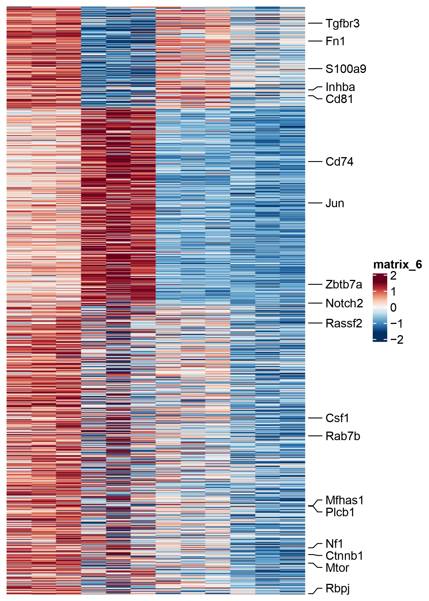
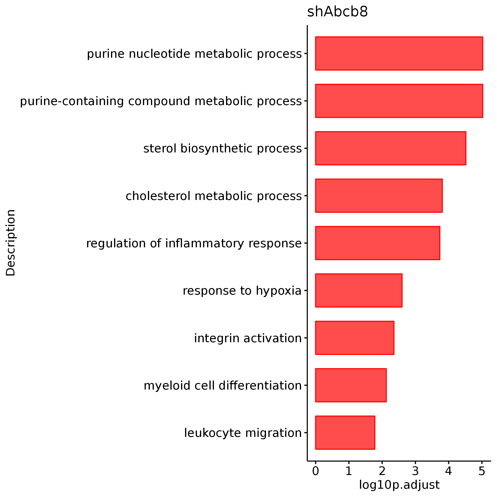
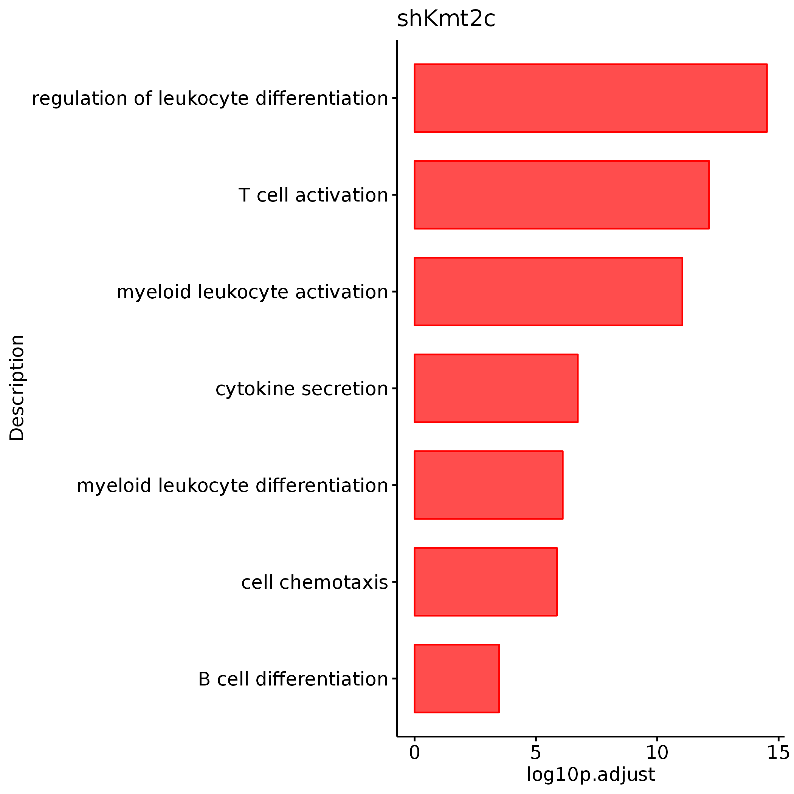
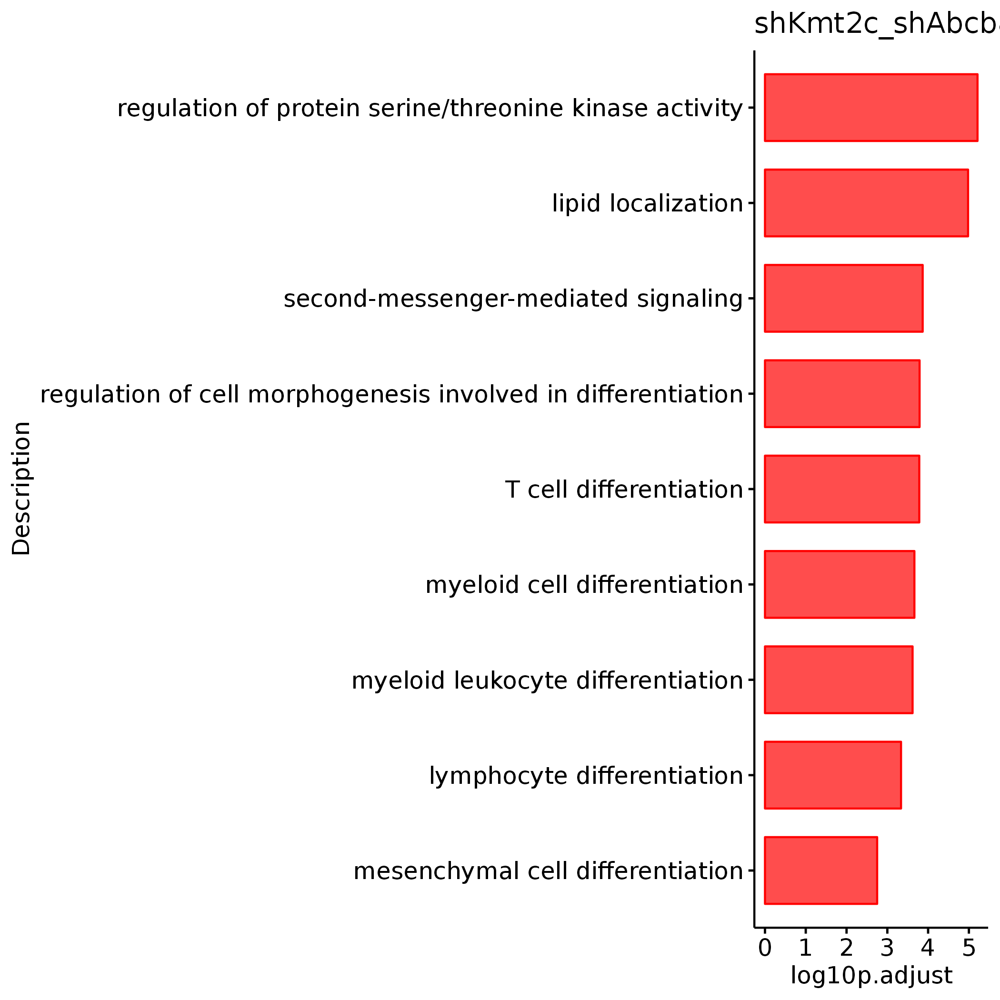
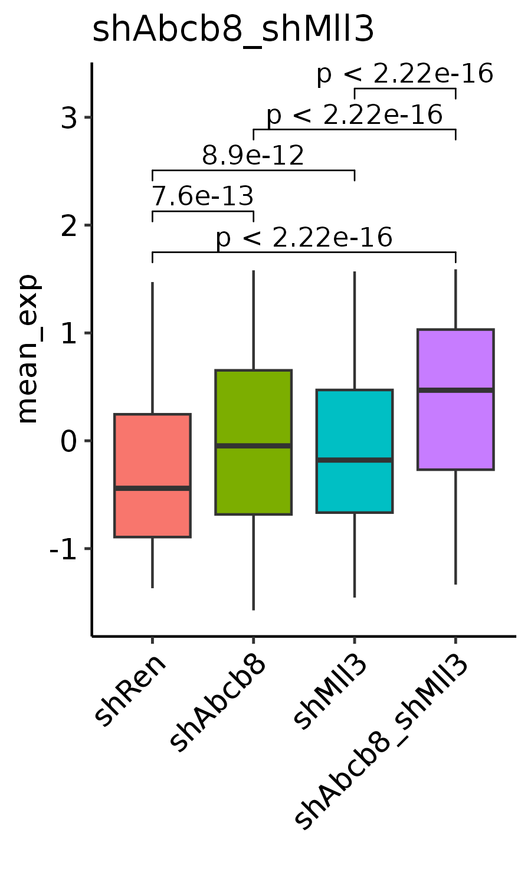

# ABCB8_Fig6

In this pipeline, we showed the detail codes in Fig6.

```
#load packages
library(Signac)
library(Seurat)
library(GenomicRanges)
library(future)
library(future.apply)
library(dplyr)
library(reticulate)
library(ReductionWrappers)
library(s2a)
library(cowplot)
library(ggplot2)
library(trqwe)
library(patchwork)
library(BuenColors)
library(paletteer)
library(ggsci)
library(AnnotationDbi)
library(org.Mm.eg.db)
library(org.Hs.eg.db)
library(clusterProfiler)
library(KEGG.db)
library(scCustomize)
library(Nebulosa)
library(SCP)
library(RColorBrewer)
library(ggpubr)
library(reshape2)
plan("multiprocess", workers = 10)
options(future.globals.maxSize = 200000 * 1024^2) # for 200 Gb RAM
```

#### Fig6E
```

annotation_row <- read.csv(row.names=1,"./annotation_row_down_onlymus_v3.csv")

dds_all_normalize <- read.csv(row.names=1,file='./shABCB8_MLL3_all_norm_counts.csv')

all_counts <- dds_all_normalize[,]
dynamic_counts <- log(all_counts+1,2)  #log2(differentiation_genesets+1)
zscore <- t(apply(dynamic_counts, 1, function(x) (x-mean(x))/sd(x)))
zscore[zscore < -1.5] <- -1.5
zscore[zscore > 1.5] <- 1.5
zscore <- na.omit(zscore)
annotation_col <- data.frame(Group=c(rep("shRen",3),rep("shAbcb8",3),rep("shMll3",3),rep("shAbcb8_shMll3",3)),row.names=colnames(zscore))
annotation_col$Group <- factor(annotation_col$Group,levels=c("shRen","shAbcb8","shMll3","shAbcb8_shMll3"))
aa <- jdb_palette("brewer_yes")[1:length(jdb_palette("brewer_spectra"))]

df <- annotation_row
df$gene <- rownames(annotation_row)
df_shuffled <- df %>%
  group_by(Cluster2) %>%
  sample_n(size = n(), replace = FALSE) %>%
  ungroup()
df_shuffled <- as.data.frame(df_shuffled)
rownames(df_shuffled) <- df_shuffled$gene
df_shuffled <- df_shuffled[,-3]
df_shuffled$Cluster2 <- factor(df_shuffled$Cluster2,levels=c("shAbcb8","shMll3","shAbcb8_shMll3"))
df_shuffled <- df_shuffled[order(df_shuffled$Cluster2),]

zscore_3 <- zscore[rownames(df_shuffled),]

order <- as.data.frame(table(df_shuffled$Cluster))
order_ <- future_lapply(1:(nrow(order)-1),function(x) {
    return(sum(order$Freq[1:x]))
    })
order <- unlist(order_)
zscore_3[zscore_3 < -1.5] <- -1.5
zscore_3[zscore_3 > 1.5] <- 1.5

only_abcb8_marker_gene <- c("Inhba","Tgfbr3","Cd81","Cd11b","Fn1","S100a9")
only_Mll3_marker_gene <- c("Cd74","Runx1","Cbfa2t2","Jun","Zbtb7a")
abcb8_mll3_marker_gene <- c("Mtor","Mfhas1","Plcb1","Nf1","Rab7b","Rassf2","Notch2","Rbpj","Ctnnb1","Csf1")

gene <- c(only_abcb8_marker_gene,only_Mll3_marker_gene,abcb8_mll3_marker_gene)
genemark <- which(rownames(zscore_3) %in% gene)
labs <- rownames(zscore_3)[genemark]
ha1 <-  rowAnnotation(
  foo = anno_mark(at = genemark,
  labels = labs,
  labels_gp = gpar(fontsize = 10)
  ))

p <- Heatmap(zscore_3, 
        cluster_rows = FALSE, 
        cluster_columns = FALSE, 
        right_annotation = ha1,
        left_annotation = NULL,
        show_row_names = FALSE,
        show_column_names = FALSE,
        col = colorRampPalette(aa)(100)
        )


```




#### Fig6F
```

GO_res <- read.csv(row.names=1,"./GO_down_gene_onlymus_Module_v2.csv")
GO_shA <- GO_res[which(GO_res$Cluster=="shAbcb8"),]
GO_shM <- GO_res[which(GO_res$Cluster=="shMll3"),]
GO_shA_M <- GO_res[which(GO_res$Cluster=="shAbcb8_shMll3"),]

GO_shA_show <- GO_shA[which(GO_shA$Description %in% c("purine-containing compound metabolic process","purine nucleotide metabolic process",
  "sterol biosynthetic process","cholesterol metabolic process","regulation of inflammatory response",
  "response to hypoxia","integrin activation","myeloid cell differentiation","leukocyte migration")),]
GO_shA_show$log10p.adjust <- -log10(GO_shA_show$p.adjust)
unique(GO_shA_show$Description)
p1 <- ggbarplot(GO_shA_show,x="Description",y="log10p.adjust",orientation = "horiz",color = "red",
  fill="red",sort.val = "asc",title="shAbcb8",alpha=0.7)
ggsave('/mnt/data/user_data/yiman/workshop/RNAseq/Abcb8_zjn/github_code/GO_shAbcb8.png')

GO_shM_show <- GO_shM[which(GO_shM$Description %in% c("regulation of leukocyte differentiation","T cell activation",
  "myeloid leukocyte activation","cytokine secretion","myeloid leukocyte differentiation",
  "cell chemotaxis","B cell differentiation")),]
GO_shM_show$log10p.adjust <- -log10(GO_shM_show$p.adjust)
unique(GO_shM_show$Description)
p2 <- ggbarplot(GO_shM_show,x="Description",y="log10p.adjust",orientation = "horiz",color = "red",
  fill="red",sort.val = "asc",title="shKmt2c",alpha=0.7)
ggsave('/mnt/data/user_data/yiman/workshop/RNAseq/Abcb8_zjn/github_code/GO_shMll3.png')


GO_shA_M_show <- GO_shA_M[which(GO_shA_M$Description %in% c("regulation of protein serine/threonine kinase activity",
  "lipid localization","second-messenger-mediated signaling","regulation of cell morphogenesis involved in differentiation",
  "T cell differentiation","myeloid cell differentiation","myeloid leukocyte differentiation",
  "lymphocyte differentiation","mesenchymal cell differentiation")),]
GO_shA_M_show$log10p.adjust <- -log10(GO_shA_M_show$p.adjust)
unique(GO_shA_M_show$Description)
p3 <- ggbarplot(GO_shA_M_show,x="Description",y="log10p.adjust",orientation = "horiz",color = "red",
  fill="red",sort.val = "asc",title="shKmt2c_shAbcb8",alpha=0.7)


```






#### Fig6G
```


GO_res <- read.csv(row.names=1,"./GO_down_gene_onlymus_Module_v2.p1.csv")
GO_res$Description <- as.character(GO_res$Description)
GO_res_p <- GO_res[which(GO_res$p.adjust < 0.05),]
GO_shA_M <- GO_res_p[which(GO_res_p$Cluster=="shAbcb8_shMll3"),]
GO_shA_M_myeloid <- GO_shA_M[grep("myeloid",GO_shA_M$Description),]
shA_M_ptw <- unique(GO_shA_M_myeloid$Description)

myeloid_info <- GO_res[which(GO_res$Description %in% shA_M_ptw),]
table(myeloid_info$Cluster)
range(GO_res$p.adjust)

p <- ggplot(myeloid_info, aes(Cluster, Description)) +
  geom_point(aes(fill=p.adjust, size=Count), shape=21)+
  scale_fill_gradient2(midpoint=0.05,low = "#DC143C", high = "blue",guide = guide_colorbar(reverse = TRUE))+
  theme_bw()+
  theme(axis.text.x=element_text(angle=90,hjust = 1,vjust=0.5),
        axis.text = element_text(color = 'black', size = 10))


```


#### Fig6H
```

plot_data <- read.csv(row.names=1,"./6H.H3K27me3.shA_shM.RNA.genes.csv")

p3 <- ggplot(plot_data, aes(x = Var3, y = mean_exp, fill = Var3)) +
  geom_boxplot() +
  labs(x = "") +
  theme_pubr() + 
  ggtitle("shAbcb8_shMll3") + 
  RotatedAxis() + 
  NoLegend() + stat_compare_means(comparisons=list(c("shRen","shAbcb8_shMll3"),
    c("shRen","shAbcb8"),c("shRen","shMll3"),c("shAbcb8","shAbcb8_shMll3"),c("shMll3","shAbcb8_shMll3")),
  method="wilcox",paired = TRUE)

```




