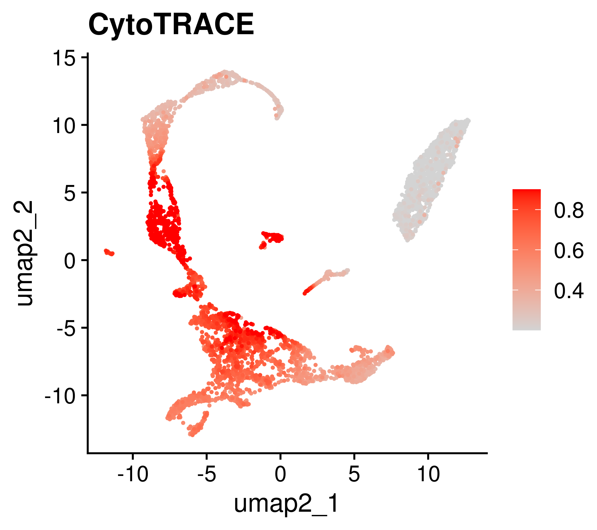

# ABCB8_FigS1

In this pipeline, we showed the detail codes in FigS1.


```
#load packages
library(Signac)
library(Seurat)
library(GenomicRanges)
library(future)
library(future.apply)
library(dplyr)
library(reticulate)
library(ReductionWrappers)
library(s2a)
library(cowplot)
library(ggplot2)
library(trqwe)
library(patchwork)
library(BuenColors)
library(paletteer)
library(ggsci)
library(AnnotationDbi)
library(org.Mm.eg.db)
library(org.Hs.eg.db)
library(clusterProfiler)
library(KEGG.db)
library(scCustomize)
library(Nebulosa)
library(SCP)
library(RColorBrewer)
library(ggpubr)
library(reshape2)
plan("multiprocess", workers = 10)
options(future.globals.maxSize = 200000 * 1024^2) # for 200 Gb RAM
```
#### Fig.S1D
```

plos_mus_normal <- mcreadRDS("/mnt/data/user_data/yiman/workshop/RNAseq/Abcb8_zjn/basic_counts/PLOS_scRNA_normal_tidy_RNA_umap.rds", mc.cores = 20)

p <- DimPlot(object = plos_mus_normal, reduction = "umap2",repel=TRUE,pt.size=0.4,label=TRUE,group.by="new_anno3",raster = FALSE) +NoLegend()

ggsave(height=4,width=4,"/mnt/data/user_data/yiman/workshop/RNAseq/Abcb8_zjn/github_code/DimPlot_PLOS_scRNA_normal.png")

```


```
DefaultAssay(plos_mus_normal) <- "RNA"
p <- XY_FeaturePlot(object = plos_mus_normal, features = "Abcb8",min.cutoff="q0",max.cutoff="q90",reduction="umap2",ncol=1,pt.size=0.4,
  raster=FALSE,raster.dpi=c(100, 100),label=F,cols = c("lightgrey","Red"))
ppi = 500
png("/mnt/data/user_data/yiman/workshop/RNAseq/Abcb8_zjn/github_code/ABCB8_FeaturePlot_PLOS_scRNA_normal_RNA_umap.png",width = 4.5*ppi, height = 4*ppi, res = ppi)
p
dev.off()

library(CytoTRACE)

data_tmp <- as.matrix(GetAssayData(object = plos_mus_normal, slot = "counts",assay="RNA"))
results <- CytoTRACE(data_tmp, ncores = 20, subsamplesize = 1000)
plos_mus_normal$CytoTRACE <- results$CytoTRACE[rownames(plos_mus_normal[[]])]
plos_mus_normal$CytoTRACErank <- results$CytoTRACErank[rownames(plos_mus_normal[[]])]

p <- XY_FeaturePlot(object = plos_mus_normal, features = "CytoTRACE",min.cutoff="q20",max.cutoff="q90",reduction="umap2",ncol=1,pt.size=0.4,
  raster=FALSE,raster.dpi=c(100, 100),label=F,cols = c("lightgrey","Red"))
ppi = 500
png("/mnt/data/user_data/yiman/workshop/RNAseq/Abcb8_zjn/github_code/CytoTRACE_FeaturePlot_PLOS_scRNA_normal_RNA_umap.png",width = 4.5*ppi, height = 4*ppi, res = ppi)
p
dev.off()

```



#### Fig.S1E
```
table(plos_mus_normal$new_anno3)
SCLC.only.GSVA <- plos_mus_normal
Idents(SCLC.only.GSVA) <- SCLC.only.GSVA$new_anno3
SCLC.only.GSVA$new_anno3 <- factor(SCLC.only.GSVA$new_anno3,levels=
  c("HSPC","GMP","MEP","Erythroblast","Erythrocytes","Mono pro","Macrophage","Neutrophil"))
All_gsva_seura_ <- future_lapply(1:length(levels(SCLC.only.GSVA$new_anno3)),function(i) {
    sel_tmp <- subset(SCLC.only.GSVA,idents=levels(SCLC.only.GSVA$new_anno3)[i])
    sel_tmp <- pseudo_bulk_seurat_mean_random(seurat_obj=sel_tmp,num_split=10,seed.use=1,slot="data",prefix=levels(SCLC.only.GSVA$new_anno3)[i],assay="RNA")
    metadata <- data.frame(cell_type=c(rep(levels(SCLC.only.GSVA$new_anno3)[i],10)),
    row.names=colnames(sel_tmp))
    sel_gsva_seurat <- CreateSeuratObject(counts = sel_tmp,assay = 'RNA',project = 'RNA',min.cells = 0,meta.data = metadata)
    message(levels(SCLC.only.GSVA$new_anno3)[i], " is done")
    return(sel_gsva_seurat)
})
All_gsva_seura <- merge(x = All_gsva_seura_[[1]], y = All_gsva_seura_[c(2:length(All_gsva_seura_))])
All_gsva_seura$cell_type <- factor(All_gsva_seura$cell_type,levels=c("HSPC","GMP","MEP","Erythroblast","Mono pro","Erythrocytes","Macrophage","Neutrophil"))
Idents(All_gsva_seura) <- All_gsva_seura$cell_type
mcsaveRDS(All_gsva_seura,"/mnt/data/user_data/yiman/workshop/RNAseq/Abcb8_zjn/basic_counts/PLOS_scRNA_normal_RNA.10.rds")

All_gsva_seura <- mcreadRDS("/mnt/data/user_data/yiman/workshop/RNAseq/Abcb8_zjn/basic_counts/PLOS_scRNA_normal_RNA.10.rds")
All_gsva_seura$cell_type <- factor(All_gsva_seura$cell_type,levels=c("HSPC","GMP","MEP","Erythroblast","Mono pro","Erythrocytes","Macrophage","Neutrophil"))

all_data <- FetchData(object = All_gsva_seura, vars = c("Abcb8","cell_type"),slot="data")
all_data$group <- "progenitor"
p <- ggboxplot(all_data[which(all_data$cell_type %in% c("HSPC","GMP","Mono pro","Macrophage","Neutrophil")),],x="cell_type",y="Abcb8",fill="cell_type",group="cell_type",alpha=0.8,
  xlab="Cell type",ylab="Abcb8 normalized counts")+RotatedAxis()+NoLegend()

ggsave("/mnt/data/user_data/yiman/workshop/RNAseq/Abcb8_zjn/github_code/ABCB8_VlnPlot_PLOS_scRNA_normal_mye.png")


```


