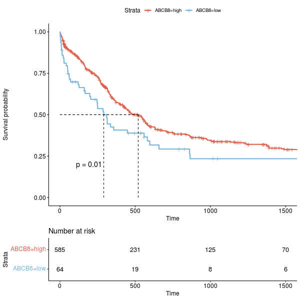
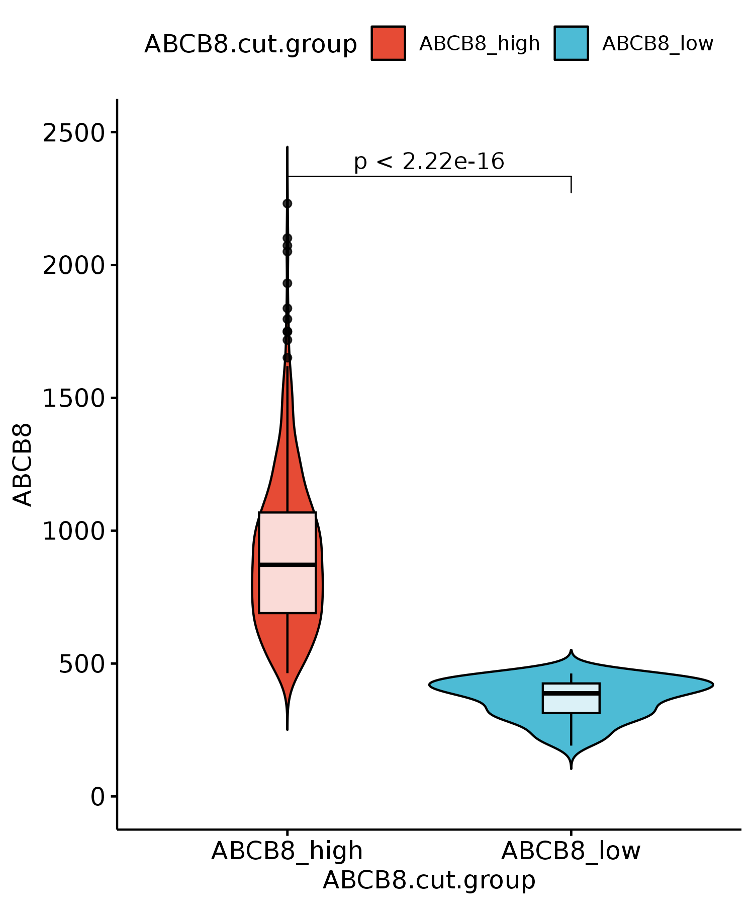

# ABCB8_FigS2

In this pipeline, we showed the detail codes in FigS2.

```
#load packages
library(Signac)
library(Seurat)
library(GenomicRanges)
library(future)
library(future.apply)
library(dplyr)
library(reticulate)
library(ReductionWrappers)
library(s2a)
library(cowplot)
library(ggplot2)
library(trqwe)
library(patchwork)
library(BuenColors)
library(paletteer)
library(ggsci)
library(AnnotationDbi)
library(org.Mm.eg.db)
library(org.Hs.eg.db)
library(clusterProfiler)
library(KEGG.db)
library(scCustomize)
library(Nebulosa)
library(SCP)
library(RColorBrewer)
library(ggpubr)
library(reshape2)
plan("multiprocess", workers = 10)
options(future.globals.maxSize = 200000 * 1024^2) # for 200 Gb RAM
```

#### FigS2A-B

```
setwd("/mnt/data/user_data/yiman/workshop/RNAseq/Abcb8_zjn/human_data/aml_ohsu_2022/BeatAML")

beat.AML.RNA.raw.counts <- read.csv(row.names=1,'beataml_waves1to4_counts_dbgap.AML.samples.csv')
beat.AML.RNA.raw.counts[1:5,1:5]
sampleTable <- data.frame(sample=colnames(beat.AML.RNA.raw.counts),tmp=c(rep("xx",300),rep("yy",371)))

dds_all <- DESeqDataSetFromMatrix(countData = beat.AML.RNA.raw.counts,
                                 colData = sampleTable,
                                 design = ~tmp)
dds_all <- DESeqDataSet(dds_all, design = ~tmp)
dds_all <- DESeq(dds_all)
dds_all_normalize <- counts(dds_all, normalized=TRUE)
colnames(dds_all_normalize) <- sampleTable$sample
dds_all_normalize <- as.data.frame(dds_all_normalize)
write.csv(dds_all_normalize,file='beataml_waves1to4.AML.samples.DESeq2.norm.counts.csv')

dds_all_normalize <- read.csv(row.names=1,file='beataml_waves1to4.AML.samples.DESeq2.norm.counts.csv')
ABCB8.exp <- dds_all_normalize["ABCB8",]
ABCB8.exp <- t(ABCB8.exp)
ABCB8.exp <- as.data.frame(ABCB8.exp)

library(data.table)

clinical <- fread("beataml_wv1to4_clinical.csv")
clinical <- as.data.frame(clinical)

both_id <- intersect(rownames(ABCB8.exp),clinical$dbgap_rnaseq_sample) #671 
ohsu_clinical <- clinical[which(clinical$dbgap_rnaseq_sample %in% both_id),]
ohsu <- ABCB8.exp[both_id,]

all_merge <- cbind(ohsu_clinical[,c("vitalStatus","overallSurvival","dbgap_rnaseq_sample")],ohsu)
colnames(all_merge)[4] <- 'ABCB8'
all_merge <- all_merge[which(all_merge$vitalStatus != "Unknown"),] #Unknown并不知道活了多少天
all_merge$vitalStatus <- ifelse(all_merge$vitalStatus=="Dead",1,0)
all_merge$overallSurvival <- as.numeric(all_merge$overallSurvival)

library("survival")
library("survminer")
coxph_result <- coxph(formula = Surv(overallSurvival, vitalStatus) ~ ABCB8, data = all_merge)

all_merge.cut <- surv_cutpoint(
   all_merge,
   time = "overallSurvival",
   event = "vitalStatus",
   variables = c("ABCB8"),
   progressbar=TRUE,
   minprop=0.1
)
summary(all_merge.cut)
plot(all_merge.cut, "ABCB8")

all_merge$ABCB8.cut.group <- ifelse(all_merge$ABCB8 > all_merge.cut$cutpoint$cutpoint, "ABCB8_high", "ABCB8_low")
table(all_merge$ABCB8.cut.group)
write.csv(all_merge,"beataml_waves1to4.AML.samples.ABCB8.exp.group.csv")

all_merge <- read.csv(row.names=1,"beataml_waves1to4.AML.samples.ABCB8.exp.group.csv")
all_merge.cut.cat <- surv_categorize(all_merge.cut) 
fit <- survfit(Surv(overallSurvival, vitalStatus) ~ ABCB8, data = all_merge.cut.cat)

p <- ggsurvplot(fit, data = all_merge.cut.cat,
surv.median.line = "hv",
pval = TRUE,
ggtheme = theme_pubr(),
risk.table=TRUE,
palette = c("#DE5F4C","#74B5DE"),
xlim=c(0,1500),break.time.by=500)

png(width=600,height=600,"/mnt/data/user_data/yiman/workshop/RNAseq/Abcb8_zjn/github_code/BeatAML.DESeq2.ABCB8.survival.v2.png")
p
dev.off()

ABCB8.info <- read.csv(row.names=1,"beataml_waves1to4.AML.samples.ABCB8.exp.group.csv")
p1 <- ggviolin(ABCB8.info, "ABCB8.cut.group", "ABCB8", fill = "ABCB8.cut.group",
   palette = "npg",add = c("boxplot"), add.params = list(fill = "white",alpha=0.8)) + ylim(0,2500) +
	stat_compare_means(comparisons=list(c("ABCB8_high","ABCB8_low")),method="t.test")
ggsave(width=5,height=6,"/mnt/data/user_data/yiman/workshop/RNAseq/Abcb8_zjn/github_code/BeatAML_violinplot.ABCB8.EXP.png")

```




#### FigS2C
```
BeatAML.low_vs_high.results <- read.csv(row.names=1,file="BeatAML.low_vs_high.results.csv")
BeatAML.low_vs_high.results$SYMBOL <- rownames(BeatAML.low_vs_high.results)

final_marker <- c("FN1","IL12B","RHAG","CAMP","RHD","LOX","SCIN","MMP9","LOX","MET")

BeatAML_DEG <- BeatAML.low_vs_high.results[which(BeatAML.low_vs_high.results$pvalue < 0.05),]
BeatAML_DEG <- BeatAML_DEG[order(BeatAML_DEG$log2FoldChange,decreasing=FALSE),]
BeatAML_down <- BeatAML_DEG[which(BeatAML_DEG$log2FoldChange < 0),]
final_marker <- BeatAML_down[which(BeatAML_down$SYMBOL %in% final_marker),]$SYMBOL
final_marker <- as.character(final_marker)

plot_data <- BeatAML.low_vs_high.results
plot_data$group <- ifelse(plot_data$pvalue < 0.05 & abs(plot_data$log2FoldChange) > 0.2,
  ifelse(plot_data$log2FoldChange > 0.2 ,"UP","DOWN"),"NS")
table(plot_data$group)
plot_data[which(plot_data$log2FoldChange < -4),]$log2FoldChange <- -4
# plot_data[which(plot_data$log2FoldChange > 4),]$log2FoldChange <- 4
plot_data$log10.pvalue <- -log10(plot_data$pvalue)
plot_data[which(plot_data$log10.pvalue > 15),]$log10.pvalue <- 15
plot_data$SYMBOL <- as.character(plot_data$SYMBOL)
plot_data <- plot_data %>%
  mutate(label = ifelse(str_detect(plot_data$SYMBOL, paste0("^", final_marker, "$", collapse = "|")),
                        final_marker[match(plot_data$SYMBOL, final_marker)],""))
table(plot_data$label)
plot_data <- plot_data[!is.na(plot_data$group),]

p1 <- ggplot(plot_data, aes(log2FoldChange,log10.pvalue,colour=group))+ labs(x="avg_log2FC",y="-log10(pvalue)")
p1 <- p1 + geom_point(alpha=1, size=2) +scale_colour_manual(name = "", values = alpha(c("#4682B4","grey","#A52A2A"), 1))+
  theme_bw() + theme(panel.grid.major = element_blank(),panel.grid.minor = element_blank(),
    axis.text.x  = element_text(size=12,colour="black"),
    axis.text.y  = element_text(size=12,,colour="black"))+
  geom_vline(xintercept=0,size = 0.7,color = "black",lty = "dashed") + 
  geom_text_repel(data = plot_data, aes(x = log2FoldChange,
  y = log10.pvalue,
  label = label),
  size = 4,box.padding = unit(0.5, "lines"),color="black",
  point.padding = unit(0.5, "lines"),
  show.legend = FALSE, max.overlaps = Inf) + xlim(-4,4)

ggsave(height=5,width=6,"./DEG_outs/MA.BeatAML.svg")
p1
dev.off()

```


