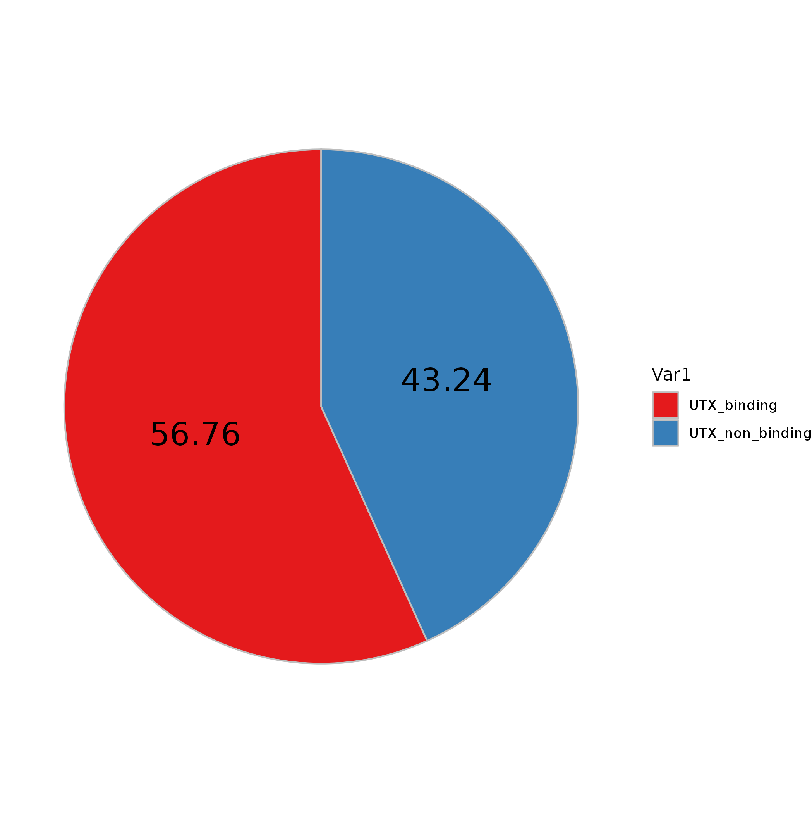
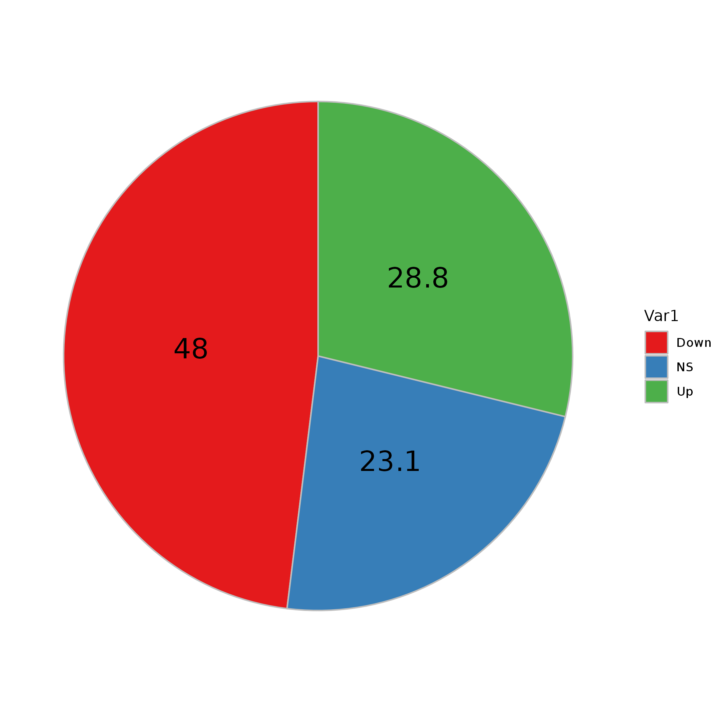
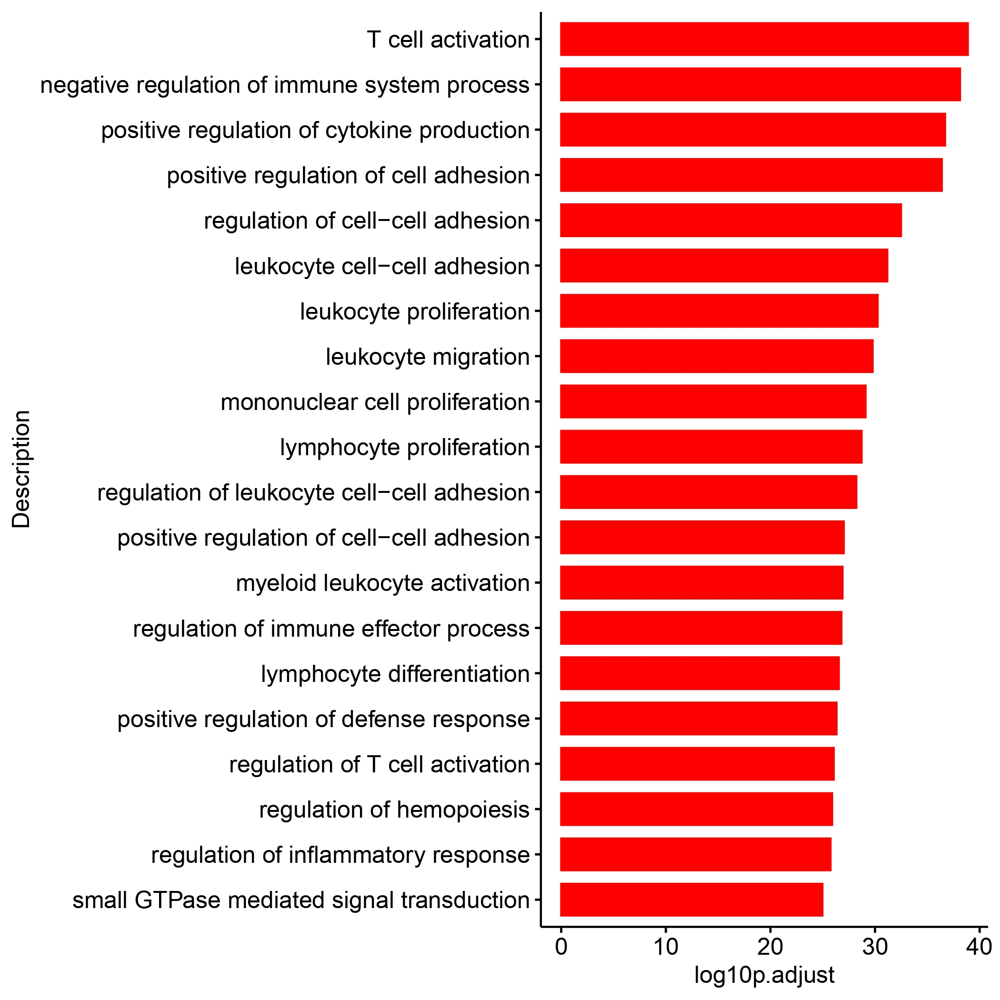

# ABCB8_Fig5

In this pipeline, we showed the detail codes in Fig5.

```
#load packages
library(Signac)
library(Seurat)
library(GenomicRanges)
library(future)
library(future.apply)
library(dplyr)
library(reticulate)
library(ReductionWrappers)
library(s2a)
library(cowplot)
library(ggplot2)
library(trqwe)
library(patchwork)
library(BuenColors)
library(paletteer)
library(ggsci)
library(AnnotationDbi)
library(org.Mm.eg.db)
library(org.Hs.eg.db)
library(clusterProfiler)
library(KEGG.db)
library(scCustomize)
library(Nebulosa)
library(SCP)
library(RColorBrewer)
library(ggpubr)
library(reshape2)
plan("multiprocess", workers = 10)
options(future.globals.maxSize = 200000 * 1024^2) # for 200 Gb RAM
```

#### FigS5A
```


library(ChIPseeker)
library(TxDb.Mmusculus.UCSC.mm10.knownGene)
txdb <- TxDb.Mmusculus.UCSC.mm10.knownGene
library(clusterProfiler)

UTX_CHIP <- read.csv(row.names=1,"/mnt/data/user_data/yiman/workshop/CUT-TAG/ABCB8/UTX_CHIP/GSM2304478_UTX-IP.anno.csv")
me3_shA_vs_shR_all <- read.csv(row.names=1,file="/mnt/data/user_data/yiman/workshop/CUT-TAG/ABCB8/DEG/H3k27me3_shA_vs_shR_all.csv")
me3_shA_vs_shR_all$group <- ifelse(abs(me3_shA_vs_shR_all$log2FoldChange) > 1 & me3_shA_vs_shR_all$pvalue < 0.05, ifelse(me3_shA_vs_shR_all$log2FoldChange > 0.5 ,'Up','Down'),'NS')
me3_shA_vs_shR_up <- me3_shA_vs_shR_all[which(me3_shA_vs_shR_all$pvalue < 0.05 & 
  me3_shA_vs_shR_all$log2FoldChange > 1),]
me3_shA_vs_shR_down <- me3_shA_vs_shR_all[which(me3_shA_vs_shR_all$pvalue < 0.05 & 
  me3_shA_vs_shR_all$log2FoldChange < -1),]

H3k27me3_up_gene <- as.character(unique(me3_shA_vs_shR_up$SYMBOL))
UTX_CHIP_gene <- as.character(unique(UTX_CHIP$SYMBOL))
ol_gene <- intersect(H3k27me3_up_gene,UTX_CHIP_gene)
nobinding <- setdiff(H3k27me3_up_gene,ol_gene)
length(H3k27me3_up_gene)
length(UTX_CHIP_gene)
length(ol_gene)
length(nobinding)

df <- data.frame(Var1=c("UTX_binding","UTX_non_binding"),
  Freq=c(length(ol_gene),length(nobinding)))
df$pct <- df$Freq / sum(df$Freq)
df$pct <- round(df$pct,4) * 100

p1 <- ggplot(df, aes(x = "", y = pct, fill = Var1)) + 
  geom_col(color = "grey") + 
  geom_text(aes(label = pct), position = position_stack(vjust = 0.5), size = 7) + 
  scale_fill_brewer(palette = c("Set1")) + 
  coord_polar("y", start = 0)  + 
  theme_void()
ggsave("/mnt/data/user_data/yiman/workshop/RNAseq/Abcb8_zjn/github_code/FigS5A.p1.png")

shA_vs_shR_all <- read.csv(row.names=1,"/mnt/data/user_data/yiman/workshop/RNAseq/Abcb8_zjn/new_RNASeq_20231228/shABCB8_vs_shRen_all.csv")
shA_vs_shR_all$group <- ifelse(abs(shA_vs_shR_all$log2FoldChange) > 0 & shA_vs_shR_all$pvalue < 0.05, ifelse(shA_vs_shR_all$log2FoldChange > 0 ,'Up','Down'),'NS')
table(shA_vs_shR_all$group)
shA_vs_shR_epi_gene <- intersect(rownames(shA_vs_shR_all),ol_gene)
length(shA_vs_shR_epi_gene)
shA_vs_shR_epi_gene_info <- shA_vs_shR_all[shA_vs_shR_epi_gene,]
dim(shA_vs_shR_epi_gene_info)
table(shA_vs_shR_epi_gene_info$group)

df <- data.frame(Var1=c("Down","NS","Up"),
  Freq=c(471,227,283))
df$pct <- df$Freq / sum(df$Freq)
df$pct <- round(df$pct,3) * 100

p2 <- ggplot(df, aes(x = "", y = pct, fill = Var1)) + 
  geom_col(color = "grey") + 
  geom_text(aes(label = pct), position = position_stack(vjust = 0.5), size = 7) + 
  scale_fill_brewer(palette = c("Set1")) + 
  coord_polar("y", start = 0)  + 
  theme_void()
ggsave("/mnt/data/user_data/yiman/workshop/RNAseq/Abcb8_zjn/github_code/FigS5A.p2.png")


```




#### FigS5B
```

AML_Utx_KO_v_WT_result <- read.csv(row.names=1,file="/mnt/data/user_data/zlu/01_job/ZJN_Abcb8_cuttag/RNA_seq/mimic_utx/Utx_05_KO_v_WT_count_DEseqnormalize_symbol_and_anno.csv")
AML_Utx_KO_v_WT_result <- na.omit(AML_Utx_KO_v_WT_result)
AML_Utx_KO_v_WT_result_p0.05 <- subset(AML_Utx_KO_v_WT_result,KO_v_WT_pvalue < 0.05)

AML_Utx_KO_v_WT_dn_0 <- AML_Utx_KO_v_WT_result_p0.05[which(AML_Utx_KO_v_WT_result_p0.05$KO_v_WT_log2FoldChange < 0),]

dn_0_entrez <- AML_Utx_KO_v_WT_dn_0$entrez
dn_0_entrez <- as.vector(dn_0_entrez)

GOupres_1_all <- enrichGO(gene = dn_0_entrez, 
             OrgDb = org.Mm.eg.db,
              ont = "BP", 
                 pvalueCutoff = 0.05, 
                     pAdjustMethod = "BH", 
                     qvalueCutoff = 0.2,
                     minGSSize = 10, 
                     maxGSSize = 500, 
                     readable = TRUE, 
                     pool = FALSE)

res_ckit_all <- read.csv(file='/mnt/data/user_data/yiman/workshop/RNAseq/Abcb8_zjn/DEG_out/res_ckit_sh_ren_all.csv',row.names=1)
abcb8_ren_rna_dn <- subset(res_ckit_all,pvalue < 0.05 & log2FoldChange < -0.5)
abcb8_ren_rna_dn <- unique(rownames(abcb8_ren_rna_dn))

sha_ren_dn <- res_ckit_all[abcb8_ren_rna_dn,c(16:17,13:15,10:12,26)]
colnames(sha_ren_dn) <- gsub("\\.1","",colnames(sha_ren_dn))

sha_ren_dn <- na.omit(sha_ren_dn) 
sha_ren_dn <- sha_ren_dn$entrez

GOupres_1_all <- enrichGO(gene = sha_ren_dn, 
             OrgDb = org.Mm.eg.db,
              ont = "BP", 
                 pvalueCutoff = 0.01, 
                     pAdjustMethod = "BH", 
                     qvalueCutoff = 0.01,
                     minGSSize = 10, 
                     maxGSSize = 500, 
                     readable = TRUE, 
                     pool = FALSE)

utx_go_dn <- GOupres_1_all@result
utx_go_dn <- utx_go_dn[which(utx_go_dn$p.adjust < 0.05),]
sha_go_dn <- GO_ckit_sha_dn@result
sha_go_dn <- sha_go_dn[which(utx_go_dn$p.adjust < 0.05),]

ol_pathway <- intersect(sha_go_dn$ID,utx_go_dn$ID)

utx_ol_go_dn <- utx_go_dn[which(utx_go_dn$ID %in% ol_pathway),]
utx_ol_go_dn$log10p.adjust <- -log10(utx_ol_go_dn$p.adjust)

p <- ggbarplot(utx_ol_go_dn[1:20,],x="Description",y="log10p.adjust",orientation = "horiz",color = "red",
  fill="red",sort.val = "asc")

ggsave("/mnt/data/user_data/yiman/workshop/RNAseq/Abcb8_zjn/github_code/shUtx_shA_common_dn.png")


```



